# Learning Curriculum — Parcours cognitif A1 → B1

**Référence pédagogique officielle du contenu Rossiyani**

*Version 1.0 — juin 2026*

**Documents liés :**

- [`ROSSIYANI_METHOD.md`](./ROSSIYANI_METHOD.md) — philosophie et cycle d'apprentissage
- [`PATTERN_SYSTEM.md`](./PATTERN_SYSTEM.md) — moteur technique (LP, instances, mastery)
- **Ce document** — *quoi* apprendre, dans *quel ordre*, via *quels contenus*

Ce document ne décrit pas des fonctionnalités.

Il décrit le **parcours cognitif** qu'un apprenant francophone suit pour construire les modèles mentaux du russe nécessaires à la lecture et à la production de textes authentiques de niveau A1 à B1.

Tout contenu éditorial — texte, exercice Compose, carte Review, fiche Vocabulary — doit se rattacher à un ou plusieurs Learning Patterns de ce curriculum.

---

## Table des matières

1. [Principes du curriculum](#1-principes-du-curriculum)
2. [Catalogue des Learning Patterns fondamentaux](#2-catalogue-des-learning-patterns-fondamentaux)
3. [Graphe d'apprentissage](#3-graphe-dapprentissage)
4. [Moments de découverte](#4-moments-de-découverte)
5. [Liens avec les contenus produit](#5-liens-avec-les-contenus-produit)
6. [Progression naturelle A1 → B1](#6-progression-naturelle-a1--b1)
7. [Pattern Paths](#7-pattern-paths)
8. [Erreurs classiques du francophone](#8-erreurs-classiques-du-francophone)
9. [Analyse critique du projet actuel](#9-analyse-critique-du-projet-actuel)
10. [Annexes](#10-annexes)

---

## 1. Principes du curriculum

### 1.1 Ce que ce curriculum est

- Un **ensemble minimal mais complet** de modèles mentaux (Learning Patterns) couvrant ~90 % des phénomènes rencontrés dans des textes authentiques A1–B1.
- Un **ordre cognitif** — pas l'ordre des manuels de grammaire.
- Un **contrat éditorial** entre Reader, collections, Compose, Review et Vocabulary.

### 1.2 Ce que ce curriculum n'est pas

- Une liste de 373 leçons de grammaire (cf. Manual actuel).
- Un découpage mécanique CECRL (« chapitre génitif »).
- Un syllabus de vocabulaire thématique isolé.

### 1.3 Règles de conception

| Règle | Application |
|-------|-------------|
| **Fonction avant forme** | On apprend « marquer la destination » avant « accusatif ». |
| **Un pattern à la fois en explication** | Plusieurs patterns peuvent coexister dans un texte ; un seul est expliqué à la première rencontre. |
| **Recycler avant d'introduire** | 70 % de familiarité lexicale ; 1–2 patterns nouveaux max par texte court. |
| **Prérequis explicites** | Aucun LP B1 sans fondations A1 correspondantes. |
| **Lecture d'abord** | Chaque LP est *introduit* dans un texte avant toute formalisation Manual. |

### 1.4 Taille du catalogue

Après analyse des besoins réels A1–B1 (textes quotidiens, dialogues, récits simples, actualité légère), le curriculum officiel comprend **54 Learning Patterns**.

Ce nombre n'est pas arbitraire :

- **Moins de 40** : lacunes sur l'aspect, le mouvement, les subordonnées, les prépositions complexes.
- **Plus de 65** : redondance (six chapitres de cas séparés), surcharge cognitive, perte de la philosophie Rossiyani.

Les 54 LP sont regroupés en **11 étapes** et **5 Pattern Paths**.

---

## 2. Catalogue des Learning Patterns fondamentaux

### Légende des champs

| Champ | Valeurs |
|-------|---------|
| **Importance** | `foundational` (indispensable) · `core` · `important` · `extending` |
| **Fréquence** | Estimation dans russe parlé/écrit courant A1–B1 |
| **Difficulté** | 1 (facile) → 5 (exigeant) |

---

### Bloc A — Décoder la langue (étape 0)

| ID | Nom utilisateur | Nom interne | Famille | Importance | Fréquence | Diff. | Prérequis |
|----|-----------------|-------------|---------|------------|-----------|-------|-----------|
| `lp.foundation.cyrillic_reading.v1` | Lire l'alphabet cyrillique | Cyrillic grapheme-to-phoneme | foundation | foundational | universelle | 1 | — |
| `lp.foundation.stress_marks.v1` | L'accent tonique guide la prononciation | Lexical stress as meaning cue | foundation | foundational | universelle | 1 | `cyrillic_reading` |
| `lp.foundation.soft_hard_consonants.v1` | Certains sons changent selon la voyelle suivante | Soft/hard consonant alternation | foundation | core | haute | 2 | `cyrillic_reading` |

---

### Bloc B — Premiers modèles de phrase (étape 1 — Situer)

| ID | Nom utilisateur | Nom interne | Famille | Importance | Fréquence | Diff. | Prérequis |
|----|-----------------|-------------|---------|------------|-----------|-------|-----------|
| `lp.syntax.zero_subject.v1` | Le russe supprime ce qui est évident | Pro-drop recoverable subjects | syntax | foundational | très haute | 2 | `cyrillic_reading` |
| `lp.morphology.nominative_default.v1` | La forme du dictionnaire est le sujet par défaut | Nominative as citation/subject form | morphology | foundational | très haute | 1 | — |
| `lp.verbs.present_conjugation.v1` | Les verbes changent selon la personne | Present tense person endings | verbs | foundational | très haute | 2 | `nominative_default` |
| `lp.syntax.basic_word_order.v1` | L'ordre des mots est flexible mais pas libre | SVO default + deviation for focus | word_order | core | haute | 2 | `zero_subject` |
| `lp.lexique.questions_intonation.v1` | Une question peut se faire par l'intonation | Yes/no via intonation + ли | lexique | core | haute | 1 | `present_conjugation` |
| `lp.syntax.negation_ne.v1` | La négation entoure le verbe | не + verb (+ genitive in existential negation later) | syntax | core | très haute | 2 | `present_conjugation` |

---

### Bloc C — Relier les mots (étape 2 — Relier)

| ID | Nom utilisateur | Nom interne | Famille | Importance | Fréquence | Diff. | Prérequis |
|----|-----------------|-------------|---------|------------|-----------|-------|-----------|
| `lp.morphology.role_terminations.v1` | Les mots changent selon leur rôle | Surface case marking on nominals | morphology | foundational | très haute | 2 | `nominative_default` |
| `lp.morphology.gender_intuition.v1` | Chaque nom est masculin, féminin ou neutre | Gender as agreement anchor | morphology | foundational | très haute | 2 | `role_terminations` |
| `lp.syntax.possession_existence.v1` | Avoir, c'est « il y a près de moi » | у + genitive / у меня есть | syntax | foundational | très haute | 2 | `role_terminations` |
| `lp.morphology.accusative_object.v1` | L'objet direct prend une autre forme | Accusative direct object (inanimate) | morphology | core | très haute | 2 | `role_terminations` |
| `lp.prepositions.v_na_location.v1` | В et На indiquent où (et parfois où aller) | в/на + prepositional vs accusative direction | prepositions | core | très haute | 3 | `role_terminations` |
| `lp.morphology.adjective_agreement.v1` | L'adjectif s'accorde avec le nom | Gender/number/case agreement on adjectives | morphology | core | haute | 3 | `gender_intuition` |

---

### Bloc D — Nuancer et quantifier (étape 3 — Qualifier)

| ID | Nom utilisateur | Nom interne | Famille | Importance | Fréquence | Diff. | Prérequis |
|----|-----------------|-------------|---------|------------|-----------|-------|-----------|
| `lp.morphology.plural_forms.v1` | Le pluriel a ses propres terminaisons | Nominative plural patterns | morphology | core | haute | 2 | `gender_intuition` |
| `lp.morphology.accusative_animate.v1` | Les êtres vivants ne se traitent pas comme les objets | Animate accusative = genitive singular | morphology | important | moyenne | 3 | `accusative_object` |
| `lp.morphology.genitive_negation.v1` | Dire « il n'y a pas » change la forme du nom | Genitive under negation of existence | morphology | core | haute | 3 | `possession_existence`, `negation_ne` |
| `lp.morphology.numbers_agreement.v1` | Les nombres influencent la forme du nom | Numeral-driven case (1/2-4/5+) | morphology | important | haute | 3 | `role_terminations`, `plural_forms` |
| `lp.prepositions.s_instrumental.v1` | « Avec » quelqu'un se dit autrement | с + instrumental companionship | prepositions | core | haute | 3 | `role_terminations` |
| `lp.syntax.impersonal_experience.v1` | « Il me froid » plutôt que « je suis froid » | Dative experiencer + neuter (мне холодно) | syntax | core | haute | 3 | `role_terminations` |

---

### Bloc E — Situer dans le temps (étape 4 — Temporalité)

| ID | Nom utilisateur | Nom interne | Famille | Importance | Fréquence | Diff. | Prérequis |
|----|-----------------|-------------|---------|------------|-----------|-------|-----------|
| `lp.verbs.past_tense_gender.v1` | Le passé change selon le genre du sujet | Past tense -л/-ла/-ло/-ли | verbs | core | très haute | 2 | `gender_intuition`, `present_conjugation` |
| `lp.verbs.future_compound.v1` | Le futur se construit avec « être » + infinitif | буду + imperfective infinitive | verbs | core | haute | 2 | `present_conjugation` |
| `lp.verbs.imperative_forms.v1` | Demander, ordonner, inviter — formes courtes | Imperative 2nd person | verbs | core | haute | 2 | `present_conjugation` |
| `lp.lexique.time_expressions.v1` | Dire quand : aujourd'hui, demain, à… heures | Temporal adverbs + в + accusative time | lexique | core | haute | 2 | `v_na_location` |
| `lp.verbs.nravitsya_dative.v1` | « Plaire » se dit à l'envers | нравиться + dative experiencer | verbs | core | haute | 3 | `impersonal_experience` |

---

### Bloc F — Moduler l'action (étape 5 — Aspect)

| ID | Nom utilisateur | Nom interne | Famille | Importance | Fréquence | Diff. | Prérequis |
|----|-----------------|-------------|---------|------------|-----------|-------|-----------|
| `lp.aspect.pair_intuition.v1` | Deux verbes proches, deux regards sur l'action | Imperfective vs perfective overview | aspect | foundational | très haute | 3 | `past_tense_gender` |
| `lp.aspect.completed_action.v1` | Action vue dans son ensemble ou achevée | Perfective for completed/punctual past | aspect | core | très haute | 3 | `pair_intuition` |
| `lp.verbs.prefix_perspective.v1` | Un préfixe change la perspective de l'action | Prefix: completion, direction, inception | verbs | core | haute | 4 | `pair_intuition` |
| `lp.aspect.process_vs_result.v1` | « En train de » vs « a fini de » | Imperfective process / perfective result | aspect | core | très haute | 3 | `pair_intuition` |
| `lp.verbs.preferred_constructions.v1` | Chaque verbe a ses constructions favorites | Verb valency + case government | lexique | core | très haute | 3 | `role_terminations` |

---

### Bloc G — Se déplacer (étape 6 — Mouvement)

| ID | Nom utilisateur | Nom interne | Famille | Importance | Fréquence | Diff. | Prérequis |
|----|-----------------|-------------|---------|------------|-----------|-------|-----------|
| `lp.motion.unidirectional.v1` | Aller dans une direction précise | Unidirectional motion (идти, ехать…) | motion | core | haute | 3 | `v_na_location` |
| `lp.motion.multidirectional.v1` | Aller dans plusieurs directions / habitude | Multidirectional (ходить, ездить…) | motion | core | haute | 3 | `unidirectional` |
| `lp.motion.prefix_direction.v1` | Entrer, sortir, traverser — le préfixe indique le sens | Motion prefixes (в-, вы-, пере-) | motion | important | haute | 4 | `unidirectional`, `prefix_perspective` |
| `lp.motion.figurative_movement.v1` | « Ça marche » — le mouvement devient métaphore | Figurative motion (дело идёт) | motion | extending | moyenne | 3 | `unidirectional` |

---

### Bloc H — Étendre les relations (étape 7 — Cas fonctionnels)

| ID | Nom utilisateur | Nom interne | Famille | Importance | Fréquence | Diff. | Prérequis |
|----|-----------------|-------------|---------|------------|-----------|-------|-----------|
| `lp.morphology.dative_recipient.v1` | Donner, dire, téléphoner — à qui ? | Dative for indirect object / recipient | morphology | core | haute | 3 | `role_terminations` |
| `lp.morphology.instrumental_means.v1` | Par quel moyen ? avec quoi ? | Instrumental for tool/means/role | morphology | important | moyenne | 3 | `s_instrumental` |
| `lp.morphology.genitive_partitive.v1` | « Un peu de », « du pain » — quantité | Genitive partitive (чай, хлеба) | morphology | important | moyenne | 3 | `genitive_negation` |
| `lp.morphology.prepositional_topic.v1` | Parler *de* / être *dans* un lieu | Prepositional for location topic & о + prep | morphology | core | haute | 3 | `v_na_location` |
| `lp.prepositions.ugol_vybor.v1` | У, к, от, для — choisir la bonne préposition | High-frequency preposition + case pairs | prepositions | important | haute | 4 | multiple case LPs |

---

### Bloc I — Construire le discours (étape 8 — Syntaxe avancée A2)

| ID | Nom utilisateur | Nom interne | Famille | Importance | Fréquence | Diff. | Prérequis |
|----|-----------------|-------------|---------|------------|-----------|-------|-----------|
| `lp.word_order.focus_end.v1` | L'information importante va souvent à la fin | End-focus / rheme placement | word_order | important | haute | 3 | `basic_word_order` |
| `lp.word_order.topicalization.v1` | Ce dont on parle peut venir en premier | Topic-fronting | word_order | important | moyenne | 3 | `focus_end` |
| `lp.syntax.coordinating_connectors.v1` | Et, mais, donc — lier des idées simples | а, но, и, поэтому | discourse | core | très haute | 2 | `basic_word_order` |
| `lp.syntax.reflexive_sya.v1` | Le verbe peut renvoyer à soi | Reflexive -ся (wash, remember…) | verbs | important | haute | 3 | `present_conjugation` |
| `lp.syntax.impersonal_constructions.v1` | Il pleut, il faut — sans « il » grammatical | Impersonal (надо, можно, нельзя) | syntax | important | haute | 3 | `impersonal_experience` |

---

### Bloc J — Raisonner et raconter (étape 9 — B1)

| ID | Nom utilisateur | Nom interne | Famille | Importance | Fréquence | Diff. | Prérequis |
|----|-----------------|-------------|---------|------------|-----------|-------|-----------|
| `lp.syntax.subordination_chto.v1` | Dire ce que l'on pense ou sait | Complement clauses с + что | syntax | core | très haute | 3 | `coordinating_connectors` |
| `lp.syntax.subordination_chtoby.v1` | Exprimer un but | чтобы + purpose clause | syntax | important | haute | 4 | `subordination_chto` |
| `lp.syntax.subordination_esli.v1` | Exprimer une condition | если + conditional | syntax | important | haute | 3 | `subordination_chto` |
| `lp.syntax.relative_kotory.v1` | Décrire avec « qui / que / dont » | Relative clauses с который | syntax | core | haute | 4 | `role_terminations`, `adjective_agreement` |
| `lp.syntax.conditional_by.v1` | L'hypothèse irréelle avec « бы » | Conditional/subjunctive бы | syntax | important | moyenne | 4 | `past_tense_gender` |
| `lp.discourse.reported_speech.v1` | Rapporter les paroles de quelqu'un | Indirect speech patterns | discourse | extending | moyenne | 4 | `subordination_chto` |

---

### Bloc K — Affiner (étape 10 — B1+)

| ID | Nom utilisateur | Nom interne | Famille | Importance | Fréquence | Diff. | Prérequis |
|----|-----------------|-------------|---------|------------|-----------|-------|-----------|
| `lp.aspect.narrative_background.v1` | Décrire le fond pendant qu'une action se passe | Imperfective background in narrative | aspect | important | moyenne | 4 | `process_vs_result` |
| `lp.pragmatique.register_tu_vy.v1` | Tutoyer ou vouvoyer change tout | ты/вы + verb agreement + formulas | pragmatique | core | haute | 2 | `present_conjugation` |
| `lp.discourse.particles_zhe_ved.v1` | De petits mots qui nuancent le ton | Discourse particles (же, ведь, ли) | discourse | extending | moyenne | 4 | `word_order_focus` |
| `lp.lexique.collocation_chunks.v1` | Certains mots vont toujours ensemble | Fixed collocations as units | lexique | core | très haute | 2 | `preferred_constructions` |
| `lp.syntax.contrast_no_a.v1` | « Mais » russe oppose, ne corrige pas | Contrastive а vs corrective но | discourse | important | haute | 3 | `coordinating_connectors` |

---

### Synthèse du catalogue

| Bloc | Étape | Nb LP | Rôle |
|------|-------|-------|------|
| A | 0 — Décoder | 3 | Accès à la langue écrite et orale |
| B | 1 — Situer | 6 | Phrase minimale viable |
| C | 2 — Relier | 6 | Rôles des mots, possession, lieu |
| D | 3 — Qualifier | 6 | Pluriel, négation profonde, quantité |
| E | 4 — Temporalité | 5 | Temps, impératif, nравиться |
| F | 5 — Aspect | 5 | Regard sur l'action |
| G | 6 — Mouvement | 4 | Déplacement physique et métaphorique |
| H | 7 — Cas fonctionnels | 5 | Cas restants par usage |
| I | 8 — Discours A2 | 5 | Focus, connecteurs, impersonnel |
| J | 9 — B1 | 6 | Subordonnées, conditionnel |
| K | 10 — B1+ | 5 | Finesse, registre, collocations |
| **Total** | | **54** | |

---

## 3. Graphe d'apprentissage

### 3.1 Vue d'ensemble

```mermaid
flowchart TB
  subgraph E0["Étape 0 — Décoder"]
    CYR[lp.foundation.cyrillic_reading]
    STR[lp.foundation.stress_marks]
    SH[lp.foundation.soft_hard_consonants]
    CYR --> STR --> SH
  end

  subgraph E1["Étape 1 — Situer"]
    NOM[lp.morphology.nominative_default]
    DROP[lp.syntax.zero_subject]
    PRS[lp.verbs.present_conjugation]
    WO[lp.syntax.basic_word_order]
    Q[lp.lexique.questions_intonation]
    NEG[lp.syntax.negation_ne]
    SH --> NOM --> DROP --> PRS
    PRS --> WO --> Q
    PRS --> NEG
  end

  subgraph E2["Étape 2 — Relier"]
    ROLE[lp.morphology.role_terminations]
    GEN[lp.morphology.gender_intuition]
    POSS[lp.syntax.possession_existence]
    ACC[lp.morphology.accusative_object]
    VNA[lp.prepositions.v_na_location]
    ADJ[lp.morphology.adjective_agreement]
    NOM --> ROLE --> GEN
    ROLE --> POSS
    ROLE --> ACC
    ROLE --> VNA
    GEN --> ADJ
  end

  subgraph E3["Étape 3 — Qualifier"]
    PL[lp.morphology.plural_forms]
    ANIM[lp.morphology.accusative_animate]
    GNEG[lp.morphology.genitive_negation]
    NUM[lp.morphology.numbers_agreement]
    SINST[lp.prepositions.s_instrumental]
    IMP[lp.syntax.impersonal_experience]
    GEN --> PL
    ACC --> ANIM
    POSS --> GNEG
    NEG --> GNEG
    ROLE --> SINST
    ROLE --> IMP
  end

  subgraph E4["Étape 4 — Temporalité"]
    PST[lp.verbs.past_tense_gender]
    FUT[lp.verbs.future_compound]
    IMPV[lp.verbs.imperative_forms]
    TIME[lp.lexique.time_expressions]
    NRAV[lp.verbs.nravitsya_dative]
    GEN --> PST
    PRS --> FUT
    PRS --> IMPV
    VNA --> TIME
    IMP --> NRAV
  end

  subgraph E5["Étape 5 — Aspect"]
    PAIR[lp.aspect.pair_intuition]
    PERF[lp.aspect.completed_action]
    PFX[lp.verbs.prefix_perspective]
    PROC[lp.aspect.process_vs_result]
    VAL[lp.verbs.preferred_constructions]
    PST --> PAIR --> PERF
    PAIR --> PFX
    PAIR --> PROC
    ROLE --> VAL
  end

  subgraph E6["Étape 6 — Mouvement"]
    UNI[lp.motion.unidirectional]
    MULTI[lp.motion.multidirectional]
    MPFX[lp.motion.prefix_direction]
    FIG[lp.motion.figurative_movement]
    VNA --> UNI --> MULTI
    UNI --> MPFX
    PFX --> MPFX
    UNI --> FIG
  end

  subgraph E7["Étape 7 — Cas fonctionnels"]
    DAT[lp.morphology.dative_recipient]
    INST[lp.morphology.instrumental_means]
    PART[lp.morphology.genitive_partitive]
    PREP[lp.morphology.prepositional_topic]
    UGOL[lp.prepositions.ugol_vybor]
    ROLE --> DAT
    SINST --> INST
    GNEG --> PART
    VNA --> PREP
    DAT --> UGOL
  end

  subgraph E8["Étape 8 — Discours"]
    FOC[lp.word_order.focus_end]
    TOP[lp.word_order.topicalization]
    COORD[lp.syntax.coordinating_connectors]
    REF[lp.syntax.reflexive_sya]
    IMP2[lp.syntax.impersonal_constructions]
    WO --> FOC --> TOP
    WO --> COORD
    PRS --> REF
    IMP --> IMP2
  end

  subgraph E9["Étape 9 — B1"]
    CHTO[lp.syntax.subordination_chto]
    CHBY[lp.syntax.subordination_chtoby]
    ES[lp.syntax.subordination_esli]
    REL[lp.syntax.relative_kotory]
    BY[lp.syntax.conditional_by]
    REP[lp.discourse.reported_speech]
    COORD --> CHTO --> CHBY
    CHTO --> ES
    ADJ --> REL
    PST --> BY
    CHTO --> REP
  end

  subgraph E10["Étape 10 — B1+"]
    NAR[lp.aspect.narrative_background]
    TVY[lp.pragmatique.register_tu_vy]
    PART[lp.discourse.particles_zhe_ved]
    COLL[lp.lexique.collocation_chunks]
    ANO[lp.syntax.contrast_no_a]
    PROC --> NAR
    PRS --> TVY
    FOC --> PART
    VAL --> COLL
    COORD --> ANO
  end
```



### 3.2 Patterns « porte » (unlock)

| LP débloqué | Débloque principalement |
|-------------|-------------------------|
| `role_terminations` | Tous les cas, prépositions, accord |
| `possession_existence` | Famille, description de situation, genitive negation |
| `pair_intuition` | Aspect, préfixes, narration passée fine |
| `unidirectional` | Voyage, directions, métaphore |
| `coordinating_connectors` | Textes multi-phrases, subordonnées |
| `subordination_chto` | Opinion, discours rapporté, B1 complet |

### 3.3 Parallélisme autorisé

Certains LP peuvent être **en observation simultanée** avant explication :

- `gender_intuition` + `accusative_object` (étape 2–3)
- `dative_recipient` + `instrumental_means` (étape 7)
- `subordination_esli` + `subordination_chtoby` (étape 9)

Jamais plus de **2 LP nouveaux expliqués** dans le même texte court.

---

## 4. Moments de découverte

### 4.1 Règles générales

| Paramètre | Valeur par défaut | Exception |
|-----------|-------------------|-----------|
| Expositions avant 1ère explication | 3 instances, ≥ 2 textes | LP `foundational` : 2 instances |
| Profondeur 1ère explication | L2 (insight) | LP diff ≥ 4 : L1 puis L2 au clic |
| Formalisation (L4) | Après état `understood` | Manual uniquement |
| Terme grammatical officiel | Jamais avant L2 | Ex. « génitif » en étape 7, pas étape 2 |

### 4.2 Table par Pattern (extraits représentatifs)

| Pattern | Découverte naturelle | Situation de lecture idéale | Expositions | Terme grammatical |
|---------|---------------------|----------------------------|-------------|-------------------|
| `role_terminations` | Même mot, terminaisons différentes dans un dialogue famille | `everyday-russian` — présentation famille | 3 | « cas » en étape 7, pas avant |
| `possession_existence` | « У меня есть… » dans description de chambre | `everyday-russian` — chez moi | 2 | « génitif » après 5 expositions |
| `zero_subject` | Dialogue court sans pronoms | `dialogues` — au café | 3 | « sujet nul » en B1 Manual |
| `pair_intuition` | Deux phrases décrivant même événement | `stories` — récit passé | 4 | « aspect » après `completed_action` |
| `unidirectional` | Aller au travail, prendre le métro | `travel-russian` / `everyday-russian` | 3 | « verbe de mouvement » en A2 |
| `subordination_chto` | Personnage pense / dit quelque chose | `stories` — récit intérieur | 3 | « proposition complétive » en B1 |
| `register_tu_vy` | Contraste ami / inconnu | `dialogues` | 2 | Immédiat (socio-linguistique, pas morpho) |

### 4.3 Signaux de noticing (Reader)

| Étape mastery | Signal UI |
|---------------|-----------|
| `latent` | Aucun |
| `observed` | Point discret en marge (optionnel) |
| `noticed` | Surlignage léger + « Remarquez la terminaison » |
| `understood` | Panneau insight/compréhension ouvert ou consulté |

---

## 5. Liens avec les contenus produit

### 5.1 Matrice Pattern → Produit

| Pattern (ex.) | Types de textes | Compose | Review | Vocabulary |
|---------------|-----------------|---------|--------|------------|
| `possession_existence` | Description lieu, famille, routine | Traduction FR « j'ai… » | Carte : phrase → sens ; rappel у | Fiche : у + lemme en contexte |
| `pair_intuition` | Récit passé, anecdote | Reformulation imperfectif ↔ perfectif | Paire de phrases | Verbe : deux formes côte à côte |
| `unidirectional` | Transport, ville | Production : décrire trajet | Choix идти/ходить | Lemmes motion + cartes |
| `subordination_chto` | Opinion, journal intime | Rédaction libre + correction que | Compléter la subordonnée | Connecteur что en tête de fiche |
| `collocation_chunks` | Tous | Reformulation anti-calque FR | Chunk → sens | Expression liée au lemme |

### 5.2 Collections → rôle curriculum

| Collection | Étapes dominantes | Rôle |
|------------|-------------------|------|
| `everyday-russian` | 1–4 | Introduction et recyclage des LP fondamentaux |
| `dialogues` | 2–5, 10 | Registre, oral, pro-drop, questions |
| `travel-russian` | 4–7 | Mouvement, prépositions, temps, demande |
| `stories` | 5–9 | Aspect, narration, subordonnées |
| `culture` | 6–10 | Vocabulaire, registre, collocations |
| `slow-news` | 8–10 | B1, subordonnées, lexique abstrait |
| `telegram` | 9–10 | Authentique, registre, particles (avec filtre) |

### 5.3 Quota éditorial par texte

| Longueur texte | LP nouveaux (max) | LP recyclés (min) |
|----------------|-------------------|-------------------|
| Court A1 (80–150 mots) | 1 | 3 |
| Moyen A2 (150–250 mots) | 1–2 | 4 |
| Long B1 (250–400 mots) | 2 | 5 |

Chaque texte publié doit déclarer dans ses métadonnées :

```yaml
curriculum:
  introduces: [lp.syntax.possession_existence.v1]
  reinforces: [lp.morphology.role_terminations.v1, lp.verbs.present_conjugation.v1]
  level: A1.2
  patternPath: path.case_and_roles  # optionnel
```

### 5.4 Compose par étape

| Étapes | Modes Compose dominants |
|--------|-------------------------|
| 1–3 | Traduction phrases courtes ; reformulation |
| 4–6 | Traduction + rédaction libre courte |
| 7–10 | Rédaction libre ; post-lecture ; reformulation registre |

### 5.5 Review par type de LP

| Famille LP | Format carte Review |
|------------|---------------------|
| Morphologie | Forme → rôle dans phrase contexte |
| Syntaxe | Phrase trou → choix de forme |
| Aspect | Contexte → imperfectif ou perfectif |
| Lexique / collocation | Chunk → sens |
| Pragmatique | Situation → ты ou вы |

---

## 6. Progression naturelle A1 → B1

Progression **cognitive**, pas calendaire. Un apprenant intensif peut couvrir A1 en ~30 textes ; un rythme modéré en ~80 textes.

### Étape 0 — Décoder *(pré-A1)*

**Objectif cognitif :** lire des mots russes à voix haute sans panique.

**LP :** 3 foundation.

**Pourquoi maintenant :** sans alphabet et accent, aucun pattern morphologique n'est observable.

**Justification vs CECRL :** le CECRL mélange alphabet et présentation ; ici c'est un prérequis technique isolé.

---

### Étape 1 — Situer *(A1.0)*

**Objectif :** comprendre qui fait quoi ; construire une phrase minimale.

**LP :** 6 (bloc B).

**Pourquoi :** avant les cas, il faut un squelette sujet–verbe–complément et la tolerance au sujet absent.

**Textes types :** dialogues ultra-courts, présentations, listes d'activités.

**CECRL équivalent :** A1.1 — mais sans introduction prématurée du génitif.

---

### Étape 2 — Relier *(A1.1)*

**Objectif :** sentir que les mots **relient** des entités (possession, lieu, objet).

**LP :** 6 (bloc C).

**Pourquoi maintenant :** l'apprenant a assez de vocabulaire pour voir la *même* régularité sur des mots différents — naissance du modèle mental « rôle → terminaison ».

**Débloque :** description du monde, pas seulement actions.

---

### Étape 3 — Qualifier *(A1.2)*

**Objectif :** nuancer (pluriel, négation d'existence, quantité, expérience personnelle).

**LP :** 6 (bloc D).

**Pourquoi :** évite d'enseigner six cas d'un coup ; introduit le génitif par **fonction** (il n'y a pas) avant le génitif par **étiquette**.

---

### Étape 4 — Temporalité *(A1.3)*

**Objectif :** situer dans le temps ; exprimer souhaits et ordres.

**LP :** 5 (bloc E).

**Pourquoi :** le passé avec genre ancre `gender_intuition` ; prépare l'aspect (avant/après dans le temps).

---

### Étape 5 — Aspect *(A2.0)*

**Objectif :** voir l'action comme processus ou résultat — **le** modèle mental distinctif du russe.

**LP :** 5 (bloc F).

**Pourquoi maintenant :** impossible sans passé/présent solides ; transforme la lecture de récits.

**Justification :** les manuels placent l'aspect en A2 ; ici il arrive **dès que** le temps est stabilisé, pas après tous les cas.

---

### Étape 6 — Mouvement *(A2.1)*

**Objectif :** déplacement physique ; préfixes directionnels.

**LP :** 4 (bloc G).

**Pourquoi :** cluster cohérent ; haute fréquence en textes voyage et quotidien.

---

### Étape 7 — Cas fonctionnels *(A2.2)*

**Objectif :** compléter les cas par **usage** (donner, moyen, quantité, sujet de discours).

**LP :** 5 (bloc H).

**Pourquoi maintenant :** datif/instrumental/prépositionnel ont chacun un **rôle clair** ; formalisation L4 « les six cas » possible ici.

---

### Étape 8 — Discours *(A2.3)*

**Objectif :** phrases liées, focus, impersonnel, réflexif.

**LP :** 5 (bloc I).

**Pourquoi :** prépare les textes multi-paragraphes et les opinions.

---

### Étape 9 — Raisonner *(B1.0)*

**Objectif :** penser et raconter avec subordonnées ; hypothèse.

**LP :** 6 (bloc J).

**Pourquoi :** seuil B1 = produire des phrases complexes, pas seulement lire des phrases coordonnées.

---

### Étape 10 — Affiner *(B1.1)*

**Objectif :** sons naturel, registre, collocations, finesse aspectuelle en récit.

**LP :** 5 (bloc K).

**Pourquoi :** derniers 10 % de authenticité ; prépare transition B2 (participes, style littéraire — hors scope ce curriculum).

---

### Tableau de correspondance indicative

| Étape Rossiyani | CECRL indicatif | Textes cumulés (ordre de grandeur) |
|-----------------|-----------------|-----------------------------------|
| 0 | Pré-A1 | 0–3 |
| 1 | A1.0 | 5–10 |
| 2 | A1.1 | 12–20 |
| 3 | A1.2 | 20–30 |
| 4 | A1.3 | 30–40 |
| 5 | A2.0 | 40–55 |
| 6 | A2.1 | 50–65 |
| 7 | A2.2 | 60–75 |
| 8 | A2.3 | 70–85 |
| 9 | B1.0 | 85–100 |
| 10 | B1.1 | 95–110 |

---

## 7. Pattern Paths

Cinq parcours transversaux. Chaque path regroupe des LP dans un ordre **à l'intérieur** du path ; les paths se croisent selon le graphe global.

---

### Path 1 — `path.case_and_roles` · Le système des rôles

**Intuition visée :** *Les terminaisons russes sont des signaux de fonction, pas des décorations.*

| Ordre | Pattern | Apport au modèle mental |
|-------|---------|-------------------------|
| 1 | `nominative_default` | Forme de base = acteur |
| 2 | `role_terminations` | Les rôles modifient la surface |
| 3 | `gender_intuition` | Accord = genre + rôle |
| 4 | `accusative_object` | Premier rôle non-sujet |
| 5 | `possession_existence` | Rôle « de qui / de quoi » |
| 6 | `genitive_negation` | Absence = forme particulière |
| 7 | `dative_recipient` | Destinataire |
| 8 | `instrumental_means` | Instrument / compagnie |
| 9 | `prepositional_topic` | Sujet de discours / lieu fixe |
| 10 | `ugol_vybor` | Carte des prépositions |

**Collections pilotes :** `everyday-russian` → `travel-russian`.

**Formalisation L4 :** après l'étape 7 du path (« les six cas »).

---

### Path 2 — `path.verbal_perspective` · Regard sur l'action

**Intuition visée :** *Le russe choisit comment **voir** l'action avant de choisir le temps.*

| Ordre | Pattern |
|-------|---------|
| 1 | `present_conjugation` |
| 2 | `past_tense_gender` |
| 3 | `pair_intuition` |
| 4 | `process_vs_result` |
| 5 | `completed_action` |
| 6 | `prefix_perspective` |
| 7 | `future_compound` |
| 8 | `narrative_background` |

**Collections :** `stories`, `everyday-russian` (récits courts).

---

### Path 3 — `path.motion_space` · Espace et déplacement

**Intuition visée :** *Se déplacer en russe, c'est choisir direction, habitude et préfixe.*

| Ordre | Pattern |
|-------|---------|
| 1 | `v_na_location` |
| 2 | `unidirectional` |
| 3 | `multidirectional` |
| 4 | `prefix_direction` |
| 5 | `figurative_movement` |

**Collections :** `travel-russian`, `everyday-russian` (métro, ville).

---

### Path 4 — `path.information_flow` · Ordre et focus

**Intuition visée :** *Ce qu'on connaît déjà vient avant ; l'information neuve, après.*

| Ordre | Pattern |
|-------|---------|
| 1 | `basic_word_order` |
| 2 | `zero_subject` |
| 3 | `focus_end` |
| 4 | `topicalization` |
| 5 | `contrast_no_a` |
| 6 | `particles_zhe_ved` |

**Collections :** `dialogues`, `stories`, `slow-news`.

---

### Path 5 — `path.discourse_complexity` · Phrases qui pensent

**Intuition visée :** *Une phrase peut contenir une autre phrase.*

| Ordre | Pattern |
|-------|---------|
| 1 | `coordinating_connectors` |
| 2 | `subordination_chto` |
| 3 | `relative_kotory` |
| 4 | `subordination_esli` |
| 5 | `subordination_chtoby` |
| 6 | `conditional_by` |
| 7 | `reported_speech` |

**Collections :** `stories` → `slow-news` → `culture`.

---

## 8. Erreurs classiques du francophone

### 8.1 Par Pattern majeur

| Pattern | Erreur typique | Confusion | Pattern concurrent | Stratégie pédagogique |
|---------|----------------|-----------|-------------------|----------------------|
| `role_terminations` | « Я вижу мама » | Calque FR accusatif = nominatif | `accusative_object` | Exposer paires minimales ; Compose cible |
| `possession_existence` | « Я имею » | Avoir ≠ иметь | `genitive_negation` | Ancrer у меня есть tôt ; jamais иметь pour possession |
| `accusative_animate` | « Вижу брата » → брата mal produit | Animé vs inanimé | `accusative_object` | Contraste côte à côte même verbe |
| `pair_intuition` | Passé perfectif pour habitude | Calque FR passé composé | `process_vs_result` | Timeline visuelle ; récits avec les deux aspects |
| `unidirectional` | « Я хожу в магазин сейчас » | Multidirectionnel par défaut | `multidirectional` | Carte « maintenant vs régulièrement » |
| `v_na_location` | « В школу » vs « в школе » | Lieu vs direction | `accusative_object` | Paires в+prep / в+acc |
| `nravitsya_dative` | « Я нравлюсь cette fille » | Sujet/objet inversés | `impersonal_experience` | Schéma « à X plaît Y » |
| `subordination_chto` | Omission de что | Calque FR relative | `relative_kotory` | Phrases pensée vs description |
| `register_tu_vy` | Ты à l'inconnu | FR tutoiement large | `pragmatique` | Dialogues contrastés dès A1 |
| `preferred_constructions` | « Помогаю маму » | Valence verbale | `dative_recipient` | Apprendre verbe + cadre ensemble |

### 8.2 Erreurs transversales

| Erreur | Patterns touchés | Réponse curriculum |
|--------|------------------|-------------------|
| Traduction mot à mot | Tous | Compose + collocations ; interdiction traduction libre |
| Ignorer l'aspect | F, J, K | Path `verbal_perspective` obligatoire avant B1 |
| Apprendre les cas par liste | H | Path `case_and_roles` fonctionnel |
| Sujet toujours explicite | B, I | Recycler `zero_subject` à chaque étape |
| Adjectif invariable | C, D | `adjective_agreement` avant adjectifs qualificatifs rares |

### 8.3 Patterns souvent confondus (à relier tôt)

| Paire | Distinction clé |
|-------|-----------------|
| `но` vs `а` | Correction vs opposition |
| `идти` vs `ходить` | Un aller vs allers multiples |
| `в` lieu vs direction | Position vs destination |
| `что` complétive vs `который` | Proposition complète vs adjectif relatif |
| `быть` existence vs copule | У меня есть vs он был |

---

## 9. Analyse critique du projet actuel

### 9.1 Écart curriculum vs Manual

| Métrique | Manual actuel | Curriculum officiel |
|----------|---------------|---------------------|
| Entrées A1–B1 | ~373 leçons | 54 LP |
| Logique | Grammaire d'abord | Observation d'abord |
| Granularité | Un chapitre = une règle | Un LP = un modèle mental |
| Rapport lecture | Faible | Chaque LP ancré à des textes |

**Verdict :** le Manual n'est **pas** le curriculum. Il devient un **index de formalisation L4** pour les LP déjà observés — ~54 entrées agrégées, pas 373.

**Leçons Manual à fusionner (exemples) :**

- `genitif-singulier`, `genitif-pluriel`, `genitif-negation` → un LP `genitive_negation` + path cas
- 15+ leçons `aspect-*` → 5 LP aspect
- 20+ leçons `motion-*` → 4 LP motion

**Leçons à rétrograder hors curriculum A1–B1 :**

- Culture pure sans LP (`culture-bolshoi-teatr`) — enrichissement, pas progression
- Phonétique ultra-fine (`prononciation-bukva-zh`) — annexe foundation, pas LP

### 9.2 Collections existantes

| Collection | Alignement | Action |
|------------|------------|--------|
| `everyday-russian` | Fort | Taguer textes par LP ; ordonner selon étapes 1–4 |
| `dialogues` | Fort | Étapes 2–5, 10 |
| `travel-russian` | Fort | Étapes 6–7 |
| `stories` | Moyen | Nécessite textes aspect/subordonnées — probablement sous-équipé |
| `slow-news` | Faible aujourd'hui | Créer pour B1 (étape 9–10) |
| `culture` | Faible | Contenu culturel sans surcharge LP |
| `telegram` | Risqué | B1+ seulement ; filtrer registre |

### 9.3 Contenus manquants (priorité éditoriale)

| Besoin | Volume indicatif | Étapes |
|--------|------------------|--------|
| Textes A1.0–A1.1 ultra-courts | 15 | 1–2 |
| Textes recyclant `role_terminations` sans nouveau LP | 20 | 2–3 |
| Récits passé + aspect | 12 | 5 |
| Textes mouvement / voyage | 10 | 6 |
| Textes subordonnées B1 | 15 | 9 |
| **Total cible** | **~100 textes tagués** | A1–B1 |

Le backlog (« 100+ textes ») est **aligné** avec ce curriculum si les textes sont tagués LP, pas seulement CECRL.

### 9.4 Contenus inutiles ou à réécrire

| Contenu | Problème | Action |
|---------|----------|--------|
| Textes « illustrant une règle » | Ressemblent à des exercices | Réécrire en situation narrative |
| Textes multi-difficulté | 5 LP nouveaux implicites | Scinder ou simplifier |
| Manual consulté avant lecture | Court-circuite le cycle | Masquer jusqu'à LP `understood` |
| Context Translation | Hors curriculum | Supprimer (cf. PATTERN_SYSTEM) |
| Leçons cas isolées sans texte | Silo grammaire | Fusionner + lier à path |

### 9.5 Composants produit

| Composant | Compatibilité | Adaptation |
|-----------|---------------|------------|
| Reader | Forte | Tag LP par phrase ; priorisation selon mastery |
| Vocabulary | Moyenne | Lier fiches aux LP du lemme |
| Review | Moyenne | Cartes LP ; pas seulement mots |
| Compose | Bonne | Mapper corrections au catalogue §2 |
| Knowledge Graph | Moyenne | Peupler 54 LP ; lier concepts |
| Home | Faible | Suggestions par étape / path, pas seulement texte |
| `editorial/levels.md` | Vide | **Remplacer** par référence à ce document |
| Import pipeline | Bon | Métadonnées `curriculum` à l'import |

### 9.6 Couverture phénoménologique A1–B1

Les 54 LP couvrent :

| Domaine | Couverture | Hors scope (B2+) |
|---------|------------|------------------|
| Morphologie nominale | ~95 % | Adjectifs courts poétiques |
| Verbes / aspect | ~90 % | Participes passifs fréquents |
| Prépositions courantes | ~85 % | Prépositions administratives rares |
| Syntaxe | ~90 % | Inversions poétiques |
| Discours | ~80 % | Argumentation complexe |
| Pragmatique | ~75 % | Argot, régionalismes |

---

## 10. Annexes

### 10.1 Hiérarchie documentaire

```
ROSSIYANI_METHOD.md     → philosophie
PATTERN_SYSTEM.md       → moteur technique
LEARNING_CURRICULUM.md  → contenu et parcours (ce document)
editorial/writing-guidelines.md → règles de rédaction des textes
features/*.md           → déclinaison par module
```

### 10.2 Checklist publication de contenu

Avant publication d'un texte :

- [ ] `introduces` et `reinforces` déclarés
- [ ] ≤ 2 LP nouveaux
- [ ] ≥ 70 % vocabulaire recyclé
- [ ] Collection cohérente avec l'étape
- [ ] Instances indexables pour chaque LP introduit
- [ ] Au moins 1 exercice Compose possible post-lecture
- [ ] Aucune formalisation L4 dans le texte lui-même

### 10.3 Index rapide des 54 IDs

```
lp.foundation.cyrillic_reading.v1
lp.foundation.stress_marks.v1
lp.foundation.soft_hard_consonants.v1
lp.syntax.zero_subject.v1
lp.morphology.nominative_default.v1
lp.verbs.present_conjugation.v1
lp.syntax.basic_word_order.v1
lp.lexique.questions_intonation.v1
lp.syntax.negation_ne.v1
lp.morphology.role_terminations.v1
lp.morphology.gender_intuition.v1
lp.syntax.possession_existence.v1
lp.morphology.accusative_object.v1
lp.prepositions.v_na_location.v1
lp.morphology.adjective_agreement.v1
lp.morphology.plural_forms.v1
lp.morphology.accusative_animate.v1
lp.morphology.genitive_negation.v1
lp.morphology.numbers_agreement.v1
lp.prepositions.s_instrumental.v1
lp.syntax.impersonal_experience.v1
lp.verbs.past_tense_gender.v1
lp.verbs.future_compound.v1
lp.verbs.imperative_forms.v1
lp.lexique.time_expressions.v1
lp.verbs.nravitsya_dative.v1
lp.aspect.pair_intuition.v1
lp.aspect.completed_action.v1
lp.verbs.prefix_perspective.v1
lp.aspect.process_vs_result.v1
lp.verbs.preferred_constructions.v1
lp.motion.unidirectional.v1
lp.motion.multidirectional.v1
lp.motion.prefix_direction.v1
lp.motion.figurative_movement.v1
lp.morphology.dative_recipient.v1
lp.morphology.instrumental_means.v1
lp.morphology.genitive_partitive.v1
lp.morphology.prepositional_topic.v1
lp.prepositions.ugol_vybor.v1
lp.word_order.focus_end.v1
lp.word_order.topicalization.v1
lp.syntax.coordinating_connectors.v1
lp.syntax.reflexive_sya.v1
lp.syntax.impersonal_constructions.v1
lp.syntax.subordination_chto.v1
lp.syntax.subordination_chtoby.v1
lp.syntax.subordination_esli.v1
lp.syntax.relative_kotory.v1
lp.syntax.conditional_by.v1
lp.discourse.reported_speech.v1
lp.aspect.narrative_background.v1
lp.pragmatique.register_tu_vy.v1
lp.discourse.particles_zhe_ved.v1
lp.lexique.collocation_chunks.v1
lp.syntax.contrast_no_a.v1
```

### 10.4 Prochaines étapes opérationnelles

1. Peupler le **pattern catalog** (54 entrées canoniques JSON).
2. Taguer les textes existants par LP (audit éditorial).
3. Rédiger **~40 textes manquants** selon §9.3.
4. Fusionner le Manual en **54 fiches L4** liées aux LP.
5. Implémenter métadonnées `curriculum` à l'import.

---

*Ce document est la référence officielle du parcours A1–B1. Tout contenu qui ne sert aucun Learning Pattern listé ici est hors curriculum et doit être justifié séparément (culture, motivation, plaisir de lire).*
