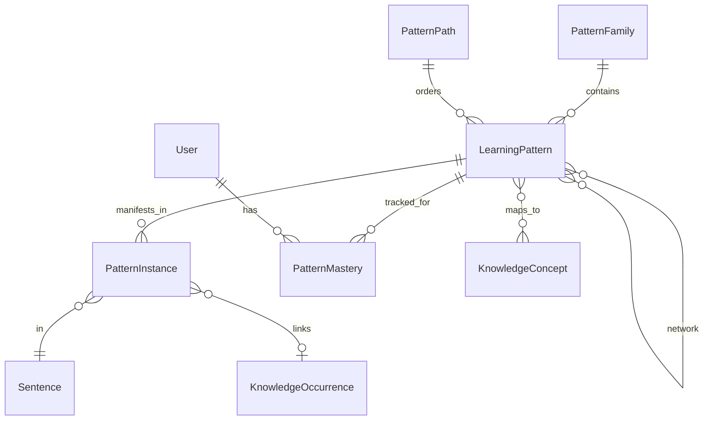
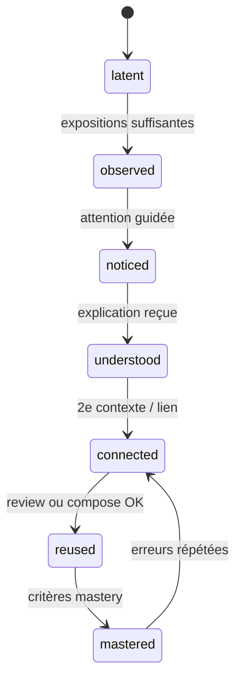

# Pattern System — Moteur pédagogique de Rossiyani

**Référence technique et pédagogique**

*Version 1.0 — juin 2026*

**Documents liés :**

- [`ROSSIYANI_METHOD.md`](./ROSSIYANI_METHOD.md) — pourquoi et comment Rossiyani apprend
- **Ce document** — comment la méthode fonctionne dans le produit
- [`KNOWLEDGE_GRAPH.md`](../KNOWLEDGE_GRAPH.md) — implémentation actuelle du graphe linguistique

Ce document ne décrit pas des écrans.

Il décrit le **moteur pédagogique** : ce qu'est un Learning Pattern, comment il naît, circule, progresse et se maîtrise dans Reader, Vocabulary, Review, Compose, Home, le Knowledge Graph, l'analyse IA et l'import de contenu.

Toute logique pédagogique de l'application doit pouvoir s'y rattacher sans ambiguïté.

---

## Table des matières

1. [Définitions et relations](#1-définitions-et-relations)
2. [Structure canonique d'un Learning Pattern](#2-structure-canonique-dun-learning-pattern)
3. [Cycle de vie](#3-cycle-de-vie)
4. [Détection](#4-détection)
5. [Progression pédagogique (niveaux d'explication)](#5-progression-pédagogique-niveaux-dexplication)
6. [Réutilisation par module](#6-réutilisation-par-module)
7. [Knowledge Graph](#7-knowledge-graph)
8. [Intelligence artificielle](#8-intelligence-artificielle)
9. [Taxonomie](#9-taxonomie)
10. [Exemples complets](#10-exemples-complets)
11. [Analyse critique du projet actuel](#11-analyse-critique-du-projet-actuel)
12. [Annexes](#12-annexes)

---

## 1. Définitions et relations

### 1.1 Learning Pattern

**Définition.** Un Learning Pattern (LP) est une **régularité linguistique pédagogiquement importante** que Rossiyani aide l'apprenant à découvrir, comprendre, relier et maîtriser — indépendamment du mot ou de la phrase particuliers où il apparaît.

**Propriétés essentielles :**

- Il est **réutilisable** : la même idée revient dans des dizaines de contextes.
- Il est **progressif** : on ne l'enseigne pas d'un coup ; on le fait émerger.
- Il est **ancré** : chaque explication pointe vers des occurrences réelles.
- Il est **non encyclopédique** : une intuition ciblée, pas un chapitre de grammaire.

**Exemples (formulation utilisateur) :**

- « Les noms changent de terminaison selon leur rôle dans la phrase. »
- « Le russe exprime la possession comme une existence à proximité. »
- « Un préfixe peut transformer une action en résultat achevé. »

**Ce qu'un LP n'est pas :** une entrée Wiktionary, une leçon Manual complète, un tag `GENITIVE`, une carte flash isolée.

---

### 1.2 Pattern Instance

**Définition.** Une Pattern Instance est la **manifestation concrète** d'un Learning Pattern dans un contexte précis : une phrase, un mot, une plage de tokens, à une position donnée.

| Attribut | Description |
|----------|-------------|
| `patternId` | LP auquel elle se rattache |
| `sentenceId` / `sentenceKey` | Phrase hôte |
| `textId` | Texte source |
| `span` | Positions début/fin (tokens ou caractères) |
| `highlightTokens` | Sous-ensemble visuellement mis en avant |
| `salience` | Score 0–1 : importance pédagogique *dans cette phrase* |
| `localNote` | Variante contextuelle de l'explication (optionnel) |

**Relation.** Un LP a **N instances** ; une instance appartient à **un seul LP principal** (éventuellement des LP secondaires en lien faible — voir détection).

```
Learning Pattern  ──1:N──►  Pattern Instance  ──N:1──►  Sentence / Text
```

---

### 1.3 Pattern Family

**Définition.** Une Pattern Family regroupe des Learning Patterns qui partagent une **grande régularité** ou un domaine cognitif commun, sans être interchangeables.

**Rôle :** navigation, taxonomie, parcours éditorial, prérequis de haut niveau.

**Exemples de familles :**

| Famille | Patterns enfants (exemples) |
|---------|------------------------------|
| `morphology.case_system` | LP « terminaisons selon le rôle », LP « négation et forme du nom » |
| `verbs.aspect` | LP « action vue dans son ensemble », LP « préfixe perfectif » |
| `syntax.possession` | LP « у + génitif », LP « у меня есть » |

**Relation.**

```
Pattern Family  ──1:N──►  Learning Pattern
```

---

### 1.4 Pattern Path

**Définition.** Un Pattern Path est un **parcours ordonné** de Learning Patterns conçu pour faire émerger un modèle mental large — typiquement au sein d'une collection éditoriale ou d'un niveau CECRL.

**Propriétés :**

- Liste ordonnée de `patternId` avec `introductionTextId` (texte où le LP est *introduit*) et `reinforcementTextIds`.
- Contraintes de prérequis entre LP du path.
- Objectif pédagogique du path (ex. « Comprendre la possession en russe »).

**Relation.**

```
Pattern Path  ──1:N (ordonné)──►  Learning Pattern
Pattern Path  ──N:1──►  Collection / Level
```

---

### 1.5 Pattern Network

**Définition.** Le Pattern Network est le **graphe relationnel global** de tous les Learning Patterns : prérequis, renforcements, alternatives, contrastes, patterns souvent confondus.

**Types de relations (arêtes) :**

| `relationType` | Signification |
|----------------|---------------|
| `prerequisite` | B suppose A |
| `reinforces` | A et B se renforcent mutuellement |
| `contrasts` | A vs B (faux amis, opposition aspectuelle) |
| `specializes` | B est un cas particulier de A |
| `often_confused_with` | Erreur fréquente |
| `same_family` | Lien faible au sein d'une famille |

**Relation.**

```
Learning Pattern  ──N:N──►  Learning Pattern   (via Pattern Network edges)
```

Le Pattern Network est la couche **pédagogique** au-dessus du graphe linguistique (`KnowledgeLemma`, `KnowledgeForm`, etc.).

---

### 1.6 Pattern Mastery

**Définition.** Pattern Mastery est l'**état de progression d'un apprenant** pour un Learning Pattern donné. Ce n'est pas une propriété du LP lui-même, mais du couple `(userId, patternId)`.

**Champs conceptuels :**

| Champ | Description |
|-------|-------------|
| `lifecycleState` | Où en est l'apprenant dans le cycle (voir §3) |
| `explanationDepthReached` | Niveau max d'explication déjà exposé (voir §5) |
| `exposureCount` | Nombre d'instances vues en lecture |
| `noticeCount` | Nombre de fois où l'attention a été guidée |
| `comprehensionSignals` | Interactions « j'ai compris » / temps sur explication |
| `retrievalScore` | Performance agrégée en Review |
| `productionScore` | Performance agrégée en Compose |
| `lastSeenAt` | Dernière instance en lecture |
| `masteredAt` | Date de passage à `mastered` (si applicable) |

**Relation.**

```
User  ──1:N──►  Pattern Mastery  ──N:1──►  Learning Pattern
```

---

### 1.7 Schéma relationnel global



---

## 2. Structure canonique d'un Learning Pattern

Chaque Learning Pattern est stocké comme document **canonique immuable** (versionné). Les instances et l'IA ne modifient pas le cœur pédagogique sans revue éditoriale.

### 2.1 Modèle de données (conceptuel)

```typescript
type LearningPattern = {
  // ─── Identité ───
  id: string;                    // "lp.case.role_terminations.v1"
  slug: string;                  // "role_terminations"
  internalName: string;          // "Case role → surface ending"
  userFacingName: string;        // "Les mots changent selon leur rôle"
  version: number;               // Incrémenté à chaque révision éditoriale
  status: "draft" | "canonical" | "deprecated";

  // ─── Taxonomie ───
  familyId: string;              // "morphology.case_system"
  taxonomyPath: string[];        // ["morphology", "case_system", "role_marking"]
  tags: string[];                // ["A1", "nouns", "endings"]

  // ─── Pédagogie ───
  pedagogicalObjective: string;  // Une phrase : quel modèle mental ?
  cognitiveSurprise: string;     // Ce qui surprend un francophone
  observation: string;           // Niveau 1 — ce qu'on voit sans expliquer
  insight: string;               // Niveau 2 — intuition, analogie
  comprehension: string;         // Niveau 3 — pourquoi ici
  formalization: string;         // Niveau 4 — jargon grammatical autorisé
  nuances: string;               // Niveau 5 — exceptions, registre, finesse

  // ─── Exemples ───
  examples: PatternExample[];    // Canoniques, multi-textes
  counterExamples: PatternExample[];
  commonErrors: CommonError[];
  variants: PatternVariant[];    // Registre, régional, alternances

  // ─── Graphe ───
  prerequisites: string[];       // patternIds
  relatedPatterns: RelatedPattern[];
  confusedWith: string[];        // patternIds

  // ─── Métadonnées ───
  recommendedLevel: CefrLevel;   // Première introduction recommandée
  frequency: "core" | "frequent" | "intermediate" | "advanced";
  difficulty: 1 | 2 | 3 | 4 | 5;
  introductionConditions: IntroductionConditions;
  masteryConditions: MasteryConditions;

  // ─── Liens linguistiques ───
  knowledgeConceptKeys: string[];  // Pont vers KnowledgeConcept existants
  detectionRules: DetectionRule[]; // Règles heuristiques + hints IA

  // ─── Audit ───
  createdAt: string;
  updatedAt: string;
  reviewedBy?: string;
};

type PatternExample = {
  id: string;
  russian: string;
  french: string;
  note?: string;
  textId?: string;
  sentenceId?: string;
  isCanonical: boolean;
};

type CommonError = {
  wrong: string;
  why: string;
  correction: string;
  learnerProfile?: "francophone" | "all";
};

type PatternVariant = {
  label: string;
  description: string;
  example: PatternExample;
};

type RelatedPattern = {
  patternId: string;
  relationType: PatternNetworkRelationType;
  label: string;
};

type IntroductionConditions = {
  minExposureCount?: number;       // Instances vues avant 1ère explication
  prerequisitePatternIds: string[];
  minReaderTextsCompleted?: number;
  editorialTextIds?: string[];     // Textes où le LP est introduit
  avoidBeforeLevel?: CefrLevel;
};

type MasteryConditions = {
  minExposureCount: number;        // ex. 5
  minRetrievalGoodRate: number;    // ex. 0.8 sur 3 cartes
  minProductionSuccess?: number;   // ex. 2 Compose sans même erreur
  minDaysSinceFirstSeen?: number;  // ex. 7 — éviter maîtrise « flash »
};

type DetectionRule = {
  type: "morphology" | "syntax" | "lexical" | "phrase" | "ai_hint";
  rule: string;                    // Description machine ou regex key
  weight: number;
};
```

### 2.2 Règles éditoriales sur les champs

| Champ | Règle |
|-------|-------|
| `userFacingName` | Français, sans jargon, < 12 mots |
| `cognitiveSurprise` | Commence par le choc franco-russe (« En français on dit…, en russe… ») |
| `observation` | Aucun terme grammatical ; décrit ce que l'œil voit |
| `insight` | Analogies autorisées ; comparaisons légères |
| `comprehension` | Explique le *pourquoi* contextuel ; 2–4 phrases max |
| `formalization` | Nomme la règle (génitif, aspect…) *après* insight |
| `nuances` | Optionnel ; réservé aux LP de difficulté ≥ 3 |
| `examples` | Minimum 3 dont 1 du corpus Rossiyani |
| `counterExamples` | Au moins 1 si le LP a des limites claires |

### 2.3 Identifiants stables

Format recommandé :

```
lp.<family>.<slug>.v<version>
```

Exemples :

- `lp.morphology.role_terminations.v1`
- `lp.syntax.possession_u_genitive.v1`
- `lp.verbs.prefix_changes_perspective.v1`

Les identifiants **ne changent jamais** ; une révision majeure crée `v2` et déprécie `v1`.

---

## 3. Cycle de vie

### 3.1 États officiels

Le cycle d'un Pattern **pour un apprenant** suit ces états :

```
Latent → Observé → Remarqué → Compris → Relié → Réutilisé → Maîtrisé
```

| État | Code | Signification |
|------|------|---------------|
| **Latent** | `latent` | Présent dans des textes lus mais pas encore assez exposé pour être traité |
| **Observé** | `observed` | L'apprenant a croisé le LP suffisamment sans explication active |
| **Remarqué** | `noticed` | L'attention a été guidée (surlignage, invite, clic) |
| **Compris** | `understood` | L'apprenant a reçu l'explication adaptée à sa profondeur |
| **Relié** | `connected` | L'apprenant a vu le LP dans un second contexte ou un LP lié |
| **Réutilisé** | `reused` | Récupération active réussie (Review) ou production (Compose) |
| **Maîtrisé** | `mastered` | Critères de maîtrise atteints (voir `masteryConditions`) |

Les transitions **ne sont pas strictement linéaires** : on peut passer de `observed` à `noticed` sans attendre un quota, ou de `understood` à `reused` directement si Compose intervient tôt. En revanche, **`mastered` exige `reused`**.

### 3.2 Critères de transition

| Transition | Critères automatiques | Critères comportementaux |
|------------|----------------------|--------------------------|
| `latent` → `observed` | `exposureCount ≥ introductionConditions.minExposureCount` (défaut : 3 instances dans ≥ 2 textes) | Lecture du texte contenant l'instance sans skip |
| `observed` → `noticed` | Système décide de surfacer le LP (voir §4) | Clic sur mot/phrase ; ouverture panneau ; invite « Remarquez… » acceptée |
| `noticed` → `understood` | Explication niveau ≥ `comprehension` affichée | Temps de lecture > seuil OU action « Compris » OU fin de panneau |
| `understood` → `connected` | `exposureCount` dans un **nouveau** texte OU lien vers LP relié consulté | Navigation vers LP lié ; 2e occurrence commentée |
| `connected` → `reused` | Review : rating `good` ou `easy` sur carte LP OU Compose : production validée `natural`/`correct` touchant le LP | — |
| `reused` → `mastered` | Tous les `masteryConditions` satisfaits | — |

### 3.3 Dégradation et révision

- Une erreur répétée en Compose sur un LP `mastered` peut le rétrograder vers `connected` (pas en dessous de `understood`).
- Un LP `mastered` non vu depuis 90 jours peut déclencher une carte Review de maintenance (reste `mastered` si succès).

### 3.4 Diagramme



---

## 4. Détection

### 4.1 Pipeline de détection (import et runtime)

Lors de l'analyse d'une phrase :

```
Phrase russe
    ↓
Analyse linguistique (mots, POS, cas, aspect, lemmes)     ← existant
    ↓
Règles heuristiques (detectionRules)                       ← nouveau
    ↓
Rattachement IA (classification, pas invention)            ← limité
    ↓
Liste de Pattern Instances candidates
    ↓
Scoring & priorisation
    ↓
Sélection du LP « primaire » à mettre en avant (0 ou 1)
```

### 4.2 Sources de détection

| Source | Rôle |
|--------|------|
| **Morphologie** | Cas, genre, nombre, animé → LP morphologiques |
| **Lemma / form** | Lemme + POS + ending → `KnowledgeForm` → LP liés |
| **Phrase / collocation** | `KnowledgePhrase` match → LP syntaxe / lexique |
| **Concept mapping** | `knowledgeConceptKeys` → pont depuis `KnowledgeConcept` |
| **IA classifieur** | Choisit parmi LP **catalogués** ; ne crée pas de LP |

### 4.3 Plusieurs Patterns dans une même phrase

**Règle fondamentale :** une interaction utilisateur = **un LP primaire**.

Algorithme de priorisation :

1. **Salience pédagogique** du LP pour le niveau de l'apprenant (patterns non encore `understood` prioritaires).
2. **Nouveauté** : LP en `latent`/`observed` avant LP déjà `mastered`.
3. **Introduction éditoriale** : LP marqué `introducedInThisText` passe devant.
4. **Score de détection** agrégé (somme des `detectionRules.weight`).
5. **Charge cognitive** : préférer le LP le plus **local** (un mot / une construction) avant le LP global (ordre des mots de toute la phrase).

Les LP secondaires :

- listés dans un panneau « Autres régularités ici » (replié par défaut) ;
- ou réservés pour une **prochaine** interaction sur la même phrase ;
- jamais expliqués simultanément au niveau `comprehension`.

### 4.4 Éviter la surcharge cognitive

| Situation | Comportement |
|-----------|--------------|
| Première lecture d'un texte | Aucun LP surfacé automatiquement ; exposition silencieuse seulement |
| 2e passage ou clic | LP primaire au niveau `observation` ou `insight` max |
| Clic explicite « Pourquoi ? » | Monter jusqu'à `comprehension` |
| Fiche Vocabulary | `formalization` disponible ; pas affichée par défaut |
| Review | Un LP par carte ; rappel `insight` + contexte |
| Compose | LP liés aux erreurs de production ; max 3 corrections nommées |

### 4.5 Matrice phrase → instances

Pour chaque phrase analysée, le système persiste :

```typescript
type SentencePatternIndex = {
  sentenceId: string;
  instances: PatternInstance[];
  primaryPatternId: string | null;
  secondaryPatternIds: string[];
  indexedAt: string;
};
```

Indexation à l'**import** (pré-calcul) ; enrichissement du `primaryPatternId` au **runtime** selon `PatternMastery` de l'utilisateur.

---

## 5. Progression pédagogique (niveaux d'explication)

Cinq niveaux d'explication — **contenu canonique du LP**, pas états de l'apprenant.

```
Observation → Insight → Compréhension → Formalisation → Nuances
```

Mapping vers les champs du LP :

| Niveau | Champ LP | Code |
|--------|----------|------|
| Observation | `observation` | `L1` |
| Insight | `insight` | `L2` |
| Compréhension | `comprehension` | `L3` |
| Formalisation | `formalization` | `L4` |
| Nuances | `nuances` | `L5` |

### 5.1 Règles par niveau

| Niveau | Objectif | Ton | Longueur | Vocabulaire autorisé | Moment d'apparition |
|--------|----------|-----|----------|----------------------|---------------------|
| **L1 Observation** | Familiariser l'œil | Neutre, descriptif | 1 phrase | Aucun jargon ; noms de mots russes OK | Dès `observed` ; recyclage en lecture |
| **L2 Insight** | Amorcer l'intuition | Comparatif, léger | 1–2 phrases | Analogies ; pas de noms de cas | `noticed` ; Review (rappel) |
| **L3 Compréhension** | Expliquer le pourquoi ici | Pédagogique, calme | 2–4 phrases | Termes simples (« terminaison », « rôle ») | Clic « Comprendre » ; Compose (correction) |
| **L4 Formalisation** | Nommer la règle | Précis, référentiel | 1 paragraphe max | Jargon grammatical autorisé | Vocabulary (section dépliée) ; Manual |
| **L5 Nuances** | Affiner | Expert accessible | Variable | Tout, avec glossaire | LP difficulté ≥ 3 ; niveau B2+ |

### 5.2 Règle d'or

**L4 ne s'affiche jamais avant L2** pour un apprenant donné sur ce LP.

Le système calcule `maxDepthAllowed(patternId, user)` :

```typescript
function maxDepthAllowed(mastery: PatternMastery): ExplanationDepth {
  if (mastery.lifecycleState === "latent") return "L1"; // ou rien
  if (mastery.lifecycleState === "observed") return "L1";
  if (mastery.lifecycleState === "noticed") return "L2";
  if (["understood", "connected"].includes(mastery.lifecycleState)) return "L3";
  if (["reused", "mastered"].includes(mastery.lifecycleState)) return "L5";
  return "L2";
}
```

L'utilisateur peut **demander plus** (« Voir la règle grammaticale ») — jamais l'inverse par défaut.

### 5.3 Cohérence inter-modules

Le **texte** de chaque niveau est identique partout ; seul le **contenant UI** change (panneau Reader, carte Review, bloc Compose).

---

## 6. Réutilisation par module

Un LP = un canon. Chaque module est une **interface** sur le même contenu.

### 6.1 Reader

| Rôle | Détection & cycle |
|------|-------------------|
| Exposition silencieuse | Incrémente `exposureCount` ; état `latent` → `observed` |
| Noticing | Surlignage discret ; invite optionnelle ; `observed` → `noticed` |
| Explication | Affiche L1–L3 selon `maxDepthAllowed` ; `noticed` → `understood` |
| Relier | Liens « Vu aussi dans… » ; navigation vers LP liés ; `connected` |

**Ne fait pas :** afficher L4 par défaut ; lister tous les LP d'une phrase ; remplacer la lecture par l'analyse.

### 6.2 Vocabulary

| Rôle | Détection & cycle |
|------|-------------------|
| Approfondir un mot | Liste les LP attachés au lemme / forme |
| Explication | L3 par défaut ; L4 sur demande |
| Relier | Pattern Network local (3 LP max visibles) |
| Contexte | Instances du mot → textes sources |

**Ne fait pas :** introduire un LP jamais exposé en lecture (sauf mode expert désactivé par défaut).

### 6.3 Review

| Rôle | Détection & cycle |
|------|-------------------|
| Récupération | Carte centrée sur LP ou mot+LP |
| Profondeur | Prompt L2 ; réponse L3 ; L1 en indice |
| Contexte | `exampleRussian` + `sourceTextTitle` obligatoires |
| Progression | Succès → `reused` ; alimente SRS par `patternId` |

**Types de cartes (évolution) :**

| Type actuel | Type cible |
|-------------|------------|
| `vocabulary` | Mot ancré à 1 LP principal |
| `grammar` | LP pur (construction) |
| `expression` | LP lexical / collocation |

### 6.4 Compose

| Rôle | Détection & cycle |
|------|-------------------|
| Mise à l'épreuve | Détecte quels LP sont violés ou fragiles |
| Feedback | Corrections mappées à `commonErrors` du LP |
| Explication | L3 + lien vers LP ; L4 si `understood` |
| Progression | Production réussie → `reused` |

**Ne fait pas :** inventer des règles hors catalogue ; traduire mot à mot.

### 6.5 Home

| Rôle | Détection & cycle |
|------|-------------------|
| Orientation | « Continuer à explorer [LP X] dans [texte Y] » |
| Révision due | « Réactiver : [userFacingName] » |
| Parcours | Pattern Path de la collection en cours |

**Ne fait pas :** recommander un texte sans lien avec un LP ou une étape du cycle.

### 6.6 Table de cohérence

| Donnée LP | Reader | Vocabulary | Review | Compose | Home |
|-----------|--------|------------|--------|---------|------|
| `userFacingName` | Invite | Titre | En-tête carte | Titre correction | Label suggestion |
| `observation` | Passif | — | Indice | — | — |
| `insight` | 1er affichage | Résumé | Prompt | — | — |
| `comprehension` | Panneau | Corps | Réponse | Explication | — |
| `formalization` | Sur demande | Section | — | Sur demande | — |
| `examples` | Contexte | Liste | Carte | Contre-exemple | — |
| `commonErrors` | — | — | — | Corrections | — |
| Pattern Mastery | Pilote UI | Pilote profondeur | Filtre cartes | Cible feedback | Suggestions |

---

## 7. Knowledge Graph

### 7.1 Position du Pattern System

```
┌─────────────────────────────────────────────────────────┐
│                    PATTERN SYSTEM                        │
│  LearningPattern · PatternInstance · PatternMastery     │
│  PatternFamily · PatternPath · PatternNetwork           │
└───────────────────────────┬─────────────────────────────┘
                            │ maps_to / detected_from
┌───────────────────────────▼─────────────────────────────┐
│              LINGUISTIC KNOWLEDGE GRAPH                  │
│  KnowledgeLemma · KnowledgeForm · KnowledgePhrase       │
│  KnowledgeConcept · KnowledgeOccurrence · …             │
└───────────────────────────┬─────────────────────────────┘
                            │ instantiates
┌───────────────────────────▼─────────────────────────────┐
│                   TEXT INSTANCES                         │
│  Text · Sentence · Word · PhraseGroup                   │
└─────────────────────────────────────────────────────────┘
```

Le Pattern System est un **citoyen de première classe** — pas un tag sur `KnowledgeConcept`, bien qu'il **s'appuie** sur lui.

### 7.2 Nouvelles entités (schéma cible)

#### `LearningPattern`

Table canonique ; contenu JSON structuré (champs §2) ou colonnes clés + JSON pour le reste.

| Colonne | Type | Notes |
|---------|------|-------|
| `id` | String @id | `lp.*` |
| `slug` | String @unique | |
| `familyId` | String | FK → PatternFamily |
| `userFacingName` | String | |
| `contentJson` | String | Canon complet versionné |
| `recommendedLevel` | CefrLevel | |
| `frequency` | Enum | |
| `difficulty` | Int | 1–5 |
| `status` | Enum | draft / canonical / deprecated |
| `version` | Int | |

#### `PatternFamily`

| Colonne | Type |
|---------|------|
| `id` | String |
| `slug` | String |
| `titleFr` | String |
| `description` | String |
| `taxonomyRoot` | String |

#### `PatternInstance`

| Colonne | Type |
|---------|------|
| `id` | String |
| `patternId` | FK LearningPattern |
| `sentenceId` | FK Sentence |
| `textId` | String |
| `startPosition` | Int |
| `endPosition` | Int |
| `salience` | Float |
| `occurrenceId` | FK KnowledgeOccurrence? |
| `phraseOccurrenceId` | FK KnowledgePhraseOccurrence? |

#### `PatternMastery`

| Colonne | Type |
|---------|------|
| `id` | String |
| `userId` | String |
| `patternId` | FK LearningPattern |
| `lifecycleState` | Enum |
| `explanationDepthReached` | Enum L1–L5 |
| `exposureCount` | Int |
| `noticeCount` | Int |
| `retrievalScore` | Float |
| `productionScore` | Float |
| `lastSeenAt` | DateTime |
| `masteredAt` | DateTime? |

`@@unique([userId, patternId])`

#### `PatternRelation`

| Colonne | Type |
|---------|------|
| `fromPatternId` | String |
| `toPatternId` | String |
| `relationType` | String |

#### `LearningPatternConcept` (pont)

| Colonne | Type |
|---------|------|
| `patternId` | FK LearningPattern |
| `conceptId` | FK KnowledgeConcept |

Permet migration progressive : un `KnowledgeConcept` existant peut mapper vers un ou plusieurs LP.

### 7.3 Relation avec l'existant

| Entité actuelle | Relation avec Pattern System |
|-----------------|------------------------------|
| `KnowledgeConcept` | **Pont** via `LearningPatternConcept` ; le concept reste pour la couche linguistique ; le LP pour la couche pédagogique |
| `KnowledgeOccurrence` | Source de `PatternInstance.occurrenceId` |
| `KnowledgePhraseOccurrence` | Source pour LP syntaxe / collocation |
| `KnowledgeLemmaConcept` | Heuristique de détection ; pas remplacé |
| `KnowledgeConceptSentence` | Remplacé à terme par `PatternInstance` + index phrase |
| `Sentence.russianLogic` | Alimente L3 contextualisé ; pas source de vérité du LP |

### 7.4 Stockage des occurrences

Chaque import :

1. Analyse phrase → mots → merge occurrence (inchangé).
2. **Nouveau :** `indexPatternInstances(sentenceId)` → crée/met à jour `PatternInstance`.
3. Met à jour compteurs globaux du LP (`hitCount` pattern).

### 7.5 Suivi progression utilisateur

**Lecture :** à chaque viewport sentence intersection → `exposureCount++` pour LP de la phrase.

**Interactions :** événements typés :

```typescript
type PatternEvent =
  | { type: "exposure"; patternId; sentenceId; textId }
  | { type: "notice"; patternId; surface: "reader" | "vocabulary" }
  | { type: "explain"; patternId; depth: ExplanationDepth }
  | { type: "connect"; patternId; relatedPatternId }
  | { type: "retrieve"; patternId; rating: ReviewRating }
  | { type: "produce"; patternId; verdict: ComposeVerdict };
```

Service unique : `pattern-mastery-service.ts` — consommé par tous les modules.

### 7.6 Migration depuis `KnowledgeConcept`

| Étape | Action |
|-------|--------|
| M1 | Créer tables LP ; peupler ~50 LP canoniques manuellement |
| M2 | Mapper `KnowledgeConcept` → LP via `LearningPatternConcept` |
| M3 | Backfill `PatternInstance` depuis phrases existantes |
| M4 | Reader consomme LP ; concepts en fallback |
| M5 | Déprécier affichage direct des concepts dans l'UI apprenant |

---

## 8. Intelligence artificielle

### 8.1 Rôle de l'IA dans le Pattern System

L'IA **ne crée pas** de Learning Patterns.

L'IA **ne rédige pas** la formalisation canonique sans revue.

L'IA :

| Action | Description |
|--------|-------------|
| **Détecte** | Parmi le catalogue LP, lesquels sont présents dans une phrase |
| **Rattache** | Crée des `PatternInstance` avec span et salience |
| **Enrichit** | `localNote` contextualisé pour L3 (non canonique, cache par phrase) |
| **Explique** | Adapte le **niveau** (L1–L5) ; réutilise le canon quand possible |
| **Diagnostique** | En Compose, mappe erreurs → `commonErrors` / LP |

### 8.2 Prompt structure (analyse phrase)

Sortie IA attendue — **extension** de l'analyse actuelle :

```json
{
  "sentenceAnalysis": { },
  "patternDetection": {
    "instances": [
      {
        "patternId": "lp.morphology.role_terminations.v1",
        "span": [2, 3],
        "salience": 0.85,
        "confidence": 0.92
      }
    ],
    "primaryPatternId": "lp.morphology.role_terminations.v1",
    "localComprehension": "Ici, la terminaison indique que le nom désigne le possesseur."
  }
}
```

**Contraintes prompt :**

- `patternId` doit exister dans le catalogue fourni en contexte.
- Si aucun LP ne correspond : `primaryPatternId: null` — pas d'invention.
- `localComprehension` ≤ 3 phrases ; français ; pas de L4 sauf demande explicite.

### 8.3 Prompt structure (Compose)

```json
{
  "affectedPatterns": [
    {
      "patternId": "lp.syntax.possession_u_genitive.v1",
      "violation": "used nominative after у",
      "depth": "L3",
      "explanation": "…"
    }
  ]
}
```

### 8.4 Cache et coût

| Donnée | Stratégie |
|--------|-----------|
| Canon LP | Statique ; zéro IA |
| `PatternInstance` index | Pré-calcul à l'import |
| `localComprehension` | Cache par `(sentenceKey, patternId)` |
| Détection | Heuristiques d'abord ; IA si confiance < seuil |

### 8.5 Révision éditoriale

Tout contenu IA non caché → `reviewStatus: PENDING` jusqu'à promotion (`CANONICAL`) via admin — même workflow que `KnowledgeConcept`.

---

## 9. Taxonomie

Taxonomie stable à **10 racines**. Les familles (`PatternFamily`) s'y rattachent ; les LP sont des feuilles ou sous-feuilles.

| Racine | `familyId` | Exemples de LP |
|--------|------------|----------------|
| **Morphologie** | `morphology` | Terminaisons selon le rôle ; pluriel ; genre |
| **Syntaxe** | `syntax` | Ordre des mots ; possession ; négation |
| **Verbes** | `verbs` | Conjugation ; pairs imperfectif/perfectif |
| **Mouvement** | `motion` | Verbes de déplacement ; préfixes de direction |
| **Aspect** | `aspect` | Action achevée vs en cours ; préfixes aspectuels |
| **Prépositions** | `prepositions` | в + lieu ; у + génitif ; о + prépositionnel |
| **Ordre des mots** | `word_order` | Thème / rhème ; focus en fin |
| **Lexique** | `lexique` | Collocations ; faux amis ; champs sémantiques |
| **Discours** | `discourse` | Connecteurs ; регистр форel/informel |
| **Pragmatique** | `pragmatique` | Politesse ; particules modales ; implications |

### 9.1 Mapping depuis `KnowledgeConceptCategory`

| `KnowledgeConceptCategory` actuel | Taxonomie LP |
|-----------------------------------|--------------|
| `GRAMMATICAL_CASE` | `morphology` |
| `GRAMMAR_PATTERN` | `syntax` ou `morphology` |
| `PREPOSITION_PATTERN` | `prepositions` |
| `CONSTRUCTION` | `syntax` ou `lexique` |
| `SEMANTIC` | `lexique` ou `pragmatique` |
| `OTHER` | À reclasser manuellement |

### 9.2 Stabilité

- Les racines **ne changent pas** (versioning majeur seulement).
- Nouveaux LP → famille existante de préférence.
- Nouvelle racine → décision produit + mise à jour de ce document.

---

## 10. Exemples complets

Cinq Learning Patterns remplis selon la structure canonique (version abrégée affichée ; champs obligatoires présents).

---

### LP 1 — `lp.morphology.role_terminations.v1`

**Les mots changent selon leur rôle dans la phrase.**

```yaml
id: lp.morphology.role_terminations.v1
internalName: "Surface case marking on nominals"
userFacingName: "Les mots changent selon leur rôle"
familyId: morphology.case_system
taxonomyPath: [morphology, case_system, role_marking]
pedagogicalObjective: "Anticiper qu'un nom russe change de forme selon sa fonction, avant de nommer les cas."
cognitiveSurprise: "En français, « ma sœur » ne change pas de forme selon le verbe ; en russe, le nom se modifie souvent."
observation: "Dans une phrase russe, un même mot peut apparaître avec des terminaisons différentes."
insight: "Ces terminaisons ne sont pas aléatoires : elles signalent le rôle du mot dans la phrase — un peu comme des étiquettes."
comprehension: "Le russe indique grammaticalement le rôle de chaque nom (qui fait quoi, à qui, de quoi) en modifiant la fin du mot. C'est pour cela que « сестра », « сестры », « сестре » ne sont pas interchangeables."
formalization: "Les noms (et adjectifs) se déclinent en six cas : nominatif, génitif, datif, accusatif, instrumental, prépositionnel. La terminaison reflète le cas et le nombre."
nuances: "Certains noms ont des désinences irrégulières ; l'animé/inanimé modifie l'accusatif masculin ; certains emprunts sont partiellement indeclinables."
recommendedLevel: A1
frequency: core
difficulty: 2
prerequisites: []
relatedPatterns:
  - { patternId: lp.morphology.negation_genitive.v1, relationType: specializes, label: "La négation de l'existence" }
introductionConditions:
  minExposureCount: 3
  prerequisitePatternIds: []
  editorialTextIds: [text-a1-family-01]
masteryConditions:
  minExposureCount: 8
  minRetrievalGoodRate: 0.8
  minProductionSuccess: 1
examples:
  - { russian: "У моей сестры есть кот.", french: "Ma sœur a un chat.", isCanonical: true }
  - { russian: "Я вижу сестру.", french: "Je vois ma sœur.", isCanonical: true }
  - { russian: "С сестрой в кино.", french: "Au cinéma avec ma sœur.", isCanonical: true }
counterExamples:
  - { russian: "Кофе был вкусный.", french: "Le café était bon.", note: "Certains emprunts ne déclinent pas au singulier." }
commonErrors:
  - { wrong: "У меня сестра", why: "Après « у », le possesseur prend une autre forme.", correction: "У меня сестра → У моей сестры (selon le sens)" }
knowledgeConceptKeys: [genitive_case, accusative_case, declension_nouns]
```

---

### LP 2 — `lp.syntax.possession_existence.v1`

**Le russe montre les relations grâce aux terminaisons — et la possession comme existence à proximité.**

```yaml
id: lp.syntax.possession_existence.v1
internalName: "Possession as existence (у + genitive / у меня есть)"
userFacingName: "Avoir, c'est « il y a près de moi »"
familyId: syntax.possession
pedagogicalObjective: "Construire l'intuition que « avoir » se dit souvent « près de quelqu'un, il y a… »"
cognitiveSurprise: "« J'ai un frère » se construit comme « il existe un frère près de moi » — pas comme une propriété directe."
observation: "Pour dire ce qu'on possède, le russe utilise souvent « у » + une forme modifiée du nom, et parfois « есть »."
insight: "Imaginez « chez moi, il y a… » plutôt que « je possède… »."
comprehension: "У меня есть брат = littéralement « près de moi, il y a un frère ». Le possesseur (меня) et l'objet possédé (брат → брата au génitif) prennent des formes qui marquent leurs rôles."
formalization: "Construction « у + génitif » pour la possession ; « у меня есть » = locution figée d'existence avec génitif de l'entité possédée."
nuances: "« Есть » est souvent omis à l'oral quand le sens est clair ; le génitif partitif pour « il y a du… » (нет хлеба)."
recommendedLevel: A1
frequency: core
difficulty: 2
prerequisites: [lp.morphology.role_terminations.v1]
examples:
  - { russian: "У меня есть брат.", french: "J'ai un frère.", isCanonical: true }
  - { russian: "У неё нет времени.", french: "Elle n'a pas le temps.", isCanonical: true }
commonErrors:
  - { wrong: "Я имею брат", why: "« Иметь » n'est pas la construction naturelle pour la possession personnelle.", correction: "У меня есть брат" }
knowledgeConceptKeys: [u_genitive_possession, existence_construction]
```

---

### LP 3 — `lp.verbs.prefix_perspective.v1`

**Les préfixes changent la perspective d'une action.**

```yaml
id: lp.verbs.prefix_perspective.v1
internalName: "Verb prefix alters action perspective (direction / completion)"
userFacingName: "Un préfixe peut transformer le regard sur l'action"
familyId: verbs.aspect
pedagogicalObjective: "Voir le préfixe comme modificateur de perspective (direction, aboutissement), pas comme liste à mémoriser."
cognitiveSurprise: "Lire « в » devant un verbe ne signifie pas seulement « dedans » — il peut indiquer un mouvement entrant ou une action menée à son terme."
observation: "Deux verbes très proches peuvent différer par un court préfixe en tête."
insight: "Le préfixe est souvent un « zoom » : direction, résultat, ou intensité de l'action."
comprehension: "Les paires comme писать / написать ou идти / войти partagent un socle ; le préfixe précise si l'action est vue dans son ensemble, vers où elle va, etc."
formalization: "Préfixes aspectuels et lexicaux : perfectivation (результат), direction (в-, вы-, при-), etc. Lié au couple imperfectif/perfectif."
nuances: "Tous les préfixes ne perfectivisent pas ; certains verbes sont perfectifs de base ; sens idiomatique (перебить ≠ « traverser »)."
recommendedLevel: A2
frequency: frequent
difficulty: 3
prerequisites: [lp.verbs.imperfective_baseline.v1]
examples:
  - { russian: "Он написал письмо.", french: "Il a écrit (et a fini) la lettre.", isCanonical: true }
  - { russian: "Он писал письмо.", french: "Il écrivait / était en train d'écrire.", isCanonical: true }
commonErrors:
  - { wrong: "Вчера я писал письмо и закончил", why: "Contexte ponctuel passé → souvent perfectif.", correction: "Вчера я написал письмо" }
knowledgeConceptKeys: [verb_prefixes, perfective_aspect]
```

---

### LP 4 — `lp.verbs.preferred_constructions.v1`

**Les verbes préfèrent certaines constructions.**

```yaml
id: lp.verbs.preferred_constructions.v1
internalName: "Verb-driven valency and construction preferences"
userFacingName: "Chaque verbe a ses constructions favorites"
familyId: lexique.collocation
pedagogicalObjective: "Développer l'intuition que le russe associe des verbes à des cadres syntaxiques fixes — pas mot à mot depuis le français."
cognitiveSurprise: "On ne « aide » pas « à quelqu'un » comme en français : « помогать » attend autre chose."
observation: "Certains verbes apparaissent toujours avec les mêmes petits mots autour d'eux."
insight: "Apprendre un verbe, c'est souvent apprendre son « cadre » — comme une coque prête à recevoir des noms."
comprehension: "Помогать требует дательный : « aider » construit « aider à quelqu'un » avec le datif (кому?), pas « à + accusatif » calqué du français."
formalization: "Régit de valence : verbes + cas obligatoires (дательный, творительный…) ; constructions figées à mémoriser par paires."
recommendedLevel: A2
frequency: frequent
difficulty: 3
prerequisites: [lp.morphology.role_terminations.v1]
examples:
  - { russian: "Я помогаю маме.", french: "J'aide maman.", isCanonical: true }
  - { russian: "Он интересуется музыкой.", french: "Il s'intéresse à la musique.", isCanonical: true }
commonErrors:
  - { wrong: "Я помогаю маму", why: "Помогать régit le datif, pas l'accusatif.", correction: "Я помогаю маме" }
knowledgeConceptKeys: [dative_case, verb_valency]
```

---

### LP 5 — `lp.syntax.zero_subject.v1`

**Le russe supprime ce qui est évident.**

```yaml
id: lp.syntax.zero_subject.v1
internalName: "Pro-drop and contextually recoverable subjects"
userFacingName: "Le russe supprime ce qui est évident"
familyId: syntax.information_structure
pedagogicalObjective: "Accepter que le sujet (et parfois « être ») disparaisse quand le contexte suffit."
cognitiveSurprise: "Une phrase « complète » en français peut n'avoir qu'un verbe en russe."
observation: "Beaucoup de phrases russes courtes n'ont pas de pronom visible pour « je / tu / il »."
insight: "Si on sait déjà de qui on parle, le russe n'a pas besoin de le répéter — le verbe porte souvent l'information."
comprehension: "Les terminaisons verbales indiquent souvent la personne ; le contexte fait le reste. « Пойдём? » = « On y va ? » sans pronom explicite."
formalization: "Pro-drop : sujet nul récupérable par conjugaison et contexte ; ellipse du copule dans certaines présentations."
nuances: "Registre parlé ; en écrit formel, le sujet peut être réintroduit pour clarté."
recommendedLevel: A1
frequency: core
difficulty: 2
prerequisites: []
examples:
  - { russian: "Пойдём в кино?", french: "On va au cinéma ?", isCanonical: true }
  - { russian: "Здесь хорошо.", french: "C'est bien ici.", isCanonical: true }
counterExamples:
  - { russian: "Он сказал, что придёт.", french: "Il a dit qu'il viendrait.", note: "Quand l'ambiguïté est réelle, le sujet revient." }
knowledgeConceptKeys: [pro_drop, subject_ellipsis]
```

---

## 11. Analyse critique du projet actuel

### 11.1 Composants compatibles (fondations réutilisables)

| Composant | Compatibilité | Comment l'utiliser |
|-----------|---------------|-------------------|
| **`KnowledgeConcept` + relations** | Forte | Pont `LearningPatternConcept` ; concepts = couche linguistique |
| **`KnowledgeOccurrence` / `KnowledgePhraseOccurrence`** | Forte | Source des `PatternInstance` |
| **`mergeOccurrence` (import)** | Forte | Point d'accroche pour `indexPatternInstances` |
| **`KnowledgeSentence` cache** | Forte | Cache analyse + futur cache `patternDetection` |
| **Reader (mot / phrase cliquables)** | Forte | UI de noticing et exposition |
| **Progression lecture (`readingProgress`)** | Moyenne | Enrichir avec événements LP |
| **Review SRS** | Moyenne | Ajouter cartes `pattern` ; lier `sourceKey` à `patternId` |
| **Compose (analyse structurée)** | Moyenne | Mapper corrections → `commonErrors` / LP |
| **Guidelines éditoriales** | Forte | Pattern Paths par collection |
| **`getLemmaKnowledge` / explorer** | Moyenne | Afficher LP liés au lieu de concepts bruts |
| **Backfill pipeline** | Forte | Backfill `PatternInstance` sans IA |

### 11.2 Composants à adapter

| Composant | Écart actuel | Adaptation requise |
|-----------|--------------|-------------------|
| **`AI_ANALYSIS_SPEC`** | Analyse exhaustive mot-à-mot ; pas de LP | Refonte : détection LP + profondeur ; mots = support, pas centre |
| **`Sentence` analysis fields** | `russianLogic`, `orderExplanation` en vrac | Dériver L3 contextualisé ; canon LP séparé |
| **Vocabulary fiches** | Tableaux morphologiques en premier | LP list en tête ; L3 défaut ; L4 replié |
| **Reader word panel** | Liens `KnowledgeConcept` | Liens `LearningPattern` + profondeur adaptée |
| **Review `build-review-content`** | Cartes mot/phrase sans LP | Champ `patternId` ; prompt L2 |
| **Compose `analyze-compose`** | `linguisticBlocks` génériques | `affectedPatterns[]` du catalogue |
| **Home `build-home-session`** | Suggestions texte-centrées | Suggestions cycle LP + texte porteur |
| **Navigation (Practice, Lessons)** | Modes hors cycle | Regrouper sous Compose ; Lessons → L4 des LP vus |
| **Glossaire produit** | `Concept`, `Discovery` | Aligner sur LP, Pattern Mastery, Instance |
| **Prisma `KnowledgeConceptCategory`** | Taxonomie linguistique | Mapper vers taxonomie LP (§9) |

### 11.3 Composants devenus inutiles ou à retirer

| Composant | Verdict | Justification |
|-----------|---------|---------------|
| **Context Translation (`/practice/context-translation`)** | **Supprimer** | Traducteur généraliste ; hors Pattern System ; contredit la méthode |
| **Practice hub legacy** (sentence builder, modes éclatés) | **Fusionner dans Compose** | Un seul lieu de *Réutiliser* |
| **Affichage direct multi-concepts par phrase** | **Supprimer** | Violation « un LP primaire » |
| **Manual comme parcours parallèle A1–C1** | **Rétrograder** | Devient index L4 des LP — pas cours indépendant |
| **Analyse complète obligatoire de chaque mot** | **Abandonner** | Charge cognitive ; remplacer par détection à la demande |
| **`Explorer` comme destination encyclopédique** | **Recentrer** | Porte d'entrée du Pattern Network depuis un mot — pas dictionnaire |

### 11.4 Simplifications possibles

1. **Un service mastery, un catalogue LP** — remplace la logique dispersée (progression mots, concepts, structures).
2. **`KnowledgeConcept` → pont uniquement** — l'UI apprenant ne voit que des LP.
3. **Import : une passe pattern** — après merge occurrence, indexer instances ; pas de deuxième IA.
4. **Review : 3 types → 1 type « pattern card »** avec variantes mot/phrase/construction.
5. **Specs IA unifiées** — `PATTERN_SYSTEM.md` + schéma JSON remplacent les sections redondantes de `AI_ANALYSIS_SPEC`.
6. **Lessons `/lessons`** — filtrer : « formalisation des LP déjà vus » ; masquer le reste.

### 11.5 Écarts documentaires à résoudre

| Document | Écart |
|----------|-------|
| `PRODUCT_BIBLE.md` | Pilier = lecture, pas Pattern System |
| `north_star.md` | Boucle Reader→Explorer→Practice→Manual — pas LP-centrique |
| `product_map.md` | Pas de couche Pattern |
| `KNOWLEDGE_GRAPH.md` | Concepts, pas LP |
| `features/vocabulary.md` | Dictionnaire morphologique |

**Hiérarchie cible :**

```
ROSSIYANI_METHOD.md  →  PATTERN_SYSTEM.md  →  KNOWLEDGE_GRAPH.md / AI specs  →  features
```

---

## 12. Annexes

### 12.1 Services à implémenter (ordre recommandé)

| Priorité | Service | Responsabilité |
|----------|---------|----------------|
| P0 | `pattern-catalog-service` | CRUD LP canoniques ; lecture seule côté app |
| P0 | `pattern-detection-service` | Heuristiques + appel IA classifieur |
| P0 | `pattern-instance-indexer` | Hook import ; `SentencePatternIndex` |
| P1 | `pattern-mastery-service` | Événements + transitions lifecycle |
| P1 | `pattern-explanation-resolver` | `maxDepthAllowed` + texte canon |
| P2 | `pattern-path-service` | Parcours éditorial par collection |
| P2 | `pattern-review-builder` | Cartes SRS depuis LP |
| P3 | `pattern-admin-service` | Revue, promotion, dépréciation LP |

### 12.2 Événements analytics (pattern-first)

```typescript
// Tous les modules émettent vers pattern-mastery-service
pattern_exposed | pattern_noticed | pattern_explained
pattern_connected | pattern_retrieved | pattern_produced | pattern_mastered
```

### 12.3 Checklist feature (rappel)

Avant tout développement :

1. Quel(s) `patternId` ?
2. Quelle transition de lifecycle ?
3. Quelle profondeur L1–L5 par défaut ?
4. Quelle instance (phrase/texte) ancre-t-on ?
5. Comment évite-t-on un second LP simultané ?

### 12.4 Relation avec `ROSSIYANI_METHOD.md`

| ROSSIYANI_METHOD | PATTERN_SYSTEM |
|------------------|----------------|
| Pourquoi les LP existent | Ce qu'est un LP techniquement |
| Cycle utilisateur (Lire → Maîtriser) | Cycle données (`latent` → `mastered`) |
| Principes de conception | Règles d'implémentation |
| Critique produit (haut niveau) | Critique composants + schéma cible |

---

*Ce document est la référence unique de la logique pédagogique applicative. Toute ambiguïté entre modules doit se trancher ici.*

*Prochaine révision prévue : après validation éditoriale du catalogue initial (~50 LP A1–B1) et prototype `pattern-mastery-service`.*
