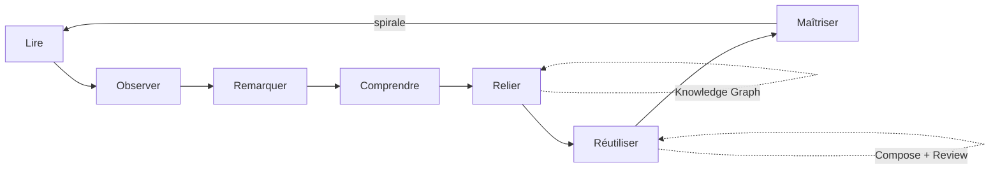

# La méthode Rossiyani

**Document fondateur — source de vérité pédagogique et stratégique**

*Version 1.0 — juin 2026*

Ce document ne décrit pas l'application Rossiyani.

Il décrit **comment Rossiyani fait apprendre le russe**.

Toute évolution du produit — fonctionnalité, contenu, interface, architecture — doit pouvoir se justifier à la lumière de ce texte. En cas de conflit entre une spécification technique et ce document, **ce document prévaut** jusqu'à révision explicite de la méthode.

---

## Table des matières

1. [Pourquoi Rossiyani existe](#1-pourquoi-rossiyani-existe)
2. [Comment on apprend réellement une langue](#2-comment-on-apprend-réellement-une-langue)
3. [Le modèle mental](#3-le-modèle-mental)
4. [Le cycle d'apprentissage Rossiyani](#4-le-cycle-dapprentissage-rossiyani)
5. [Les Learning Patterns](#5-les-learning-patterns)
6. [La progression pédagogique](#6-la-progression-pédagogique)
7. [Le rôle de chaque partie du produit](#7-le-rôle-de-chaque-partie-du-produit)
8. [Le Knowledge Graph](#8-le-knowledge-graph)
9. [Principes de conception](#9-principes-de-conception)
10. [Analyse critique du produit actuel](#10-analyse-critique-du-produit-actuel)
11. [Implications pour la suite](#11-implications-pour-la-suite)

---

## 1. Pourquoi Rossiyani existe

### Le problème réel

Apprendre le russe pose un problème structurel : **la langue fonctionne différemment du français**, et cette différence n'est pas accessoire — elle est profonde (cas, aspect verbal, ordre des mots flexible, absence d'articles, système aspectuel plutôt que temporel, etc.).

La plupart des apprenants francophones n'échouent pas par manque d'effort. Ils échouent parce que :

1. **Ils accumulent des règles sans intuition.** Ils savent nommer le génitif, mais ne « sentent » pas quand il est requis.
2. **Ils traduisent mentalement.** Ils construisent du russe à partir du français, ce qui produit des phrases grammaticalement possibles mais non naturelles.
3. **Ils décrochent entre les étapes.** Lecture passive, listes de mots, exercices déconnectés et cours de grammaire forment des silos qui ne se renforcent pas mutuellement.
4. **Ils n'ont pas assez d'exposition contextualisée.** Les manuels isolent les notions ; l'immersion seule laisse trop d'éléments implicites non résolus.
5. **Ils n'ont pas assez de production guidée.** Comprendre ne garantit pas produire ; sans récupération active, les modèles restent fragiles.

### Pourquoi les approches classiques sont insuffisantes

| Approche | Limite fondamentale |
|----------|---------------------|
| **Grammaire explicite (manuel, cours)** | Produit de la métalangue, pas de l'intuition. Les règles se multiplient plus vite que la capacité à les appliquer en temps réel. |
| **Traduction (FR↔RU)** | Renforce le français comme langue pivot. Masque les régularités propres au russe. |
| **Mémorisation (flashcards isolées)** | Retient des formes sans ancrage situationnel. Faible transfert vers la lecture et la production. |
| **Immersion seule** | Nécessite un volume d'input immense ; sans guidage, les erreurs et les lacunes se fossilisent. |
| **Lecteurs annotés / LingQ-like** | Excellents pour l'input, mais souvent des dictionnaires améliorés : beaucoup d'information, peu de construction de modèles. |

### La différence fondamentale de Rossiyani

Rossiyani n'essaie pas d'être le meilleur dictionnaire, le meilleur lecteur annoté ou le meilleur cours de grammaire.

**Rossiyani aide l'apprenant à construire progressivement des modèles mentaux fiables du fonctionnement du russe — à partir de textes réels, par observation guidée, sans l'impression de suivre un cours.**

Concrètement :

- On **lit** d'abord (input compréhensible).
- On **remarque** des régularités (noticing).
- On **comprend** pourquoi une forme apparaît ici (explication contextualisée, pas encyclopédique).
- On **relie** cette régularité à d'autres occurrences.
- On **réactive** cette connaissance (récupération espacée).
- On **réutilise** en production (Compose).
- On **consolide** jusqu'à ce que la forme devienne intuitive.

Rossiyani est une **méthode d'apprentissage par la lecture intelligente**, pas une collection de fonctionnalités.

---

## 2. Comment on apprend réellement une langue

Cette section s'appuie sur des principes établis en psychologie cognitive et en acquisition des langues secondes (AL2). Rossiyani ne les applique pas tous de façon naïve — il les **orchestre** dans un cycle cohérent.

### 2.1 Reconnaissance de régularités (pattern recognition)

Le cerveau apprend les langues en détectant des **régularités statistiques** et structurelles dans l'input : quelles formes co-apparaissent, quels suffixes signalent quoi, quels cadres syntaxiques se répètent.

**Implication Rossiyani :** exposer les mêmes patterns dans des contextes variés avant de les nommer. Un Learning Pattern doit être *vu* plusieurs fois avant d'être *expliqué*.

### 2.2 Exposition répétée (input flooding contrôlé)

La mémorisation lexicale et structurelle nécessite **plusieurs rencontres** avec une forme, idéalement dans des contextes légèrement différents (variance contextuelle).

**Implication Rossiyani :** la bibliothèque éditoriale doit recycler volontairement vocabulaire et structures. Le Knowledge Graph doit tracer les occurrences pour montrer « vous avez déjà vu ceci ».

### 2.3 Récupération active (retrieval practice)

Rappeler une information — plutôt que la relire passivement — renforce durablement la trace mnésique (effet de test). C'est le fondement scientifique de la répétition espacée.

**Implication Rossiyani :** Review n'est pas une fin en soi ; c'est la **réactivation** d'un pattern déjà rencontré en lecture. Les cartes doivent renvoyer au contexte d'origine, pas isoler un mot.

### 2.4 Contextualisation (encodage sémantique riche)

Une information ancrée dans un **contexte significatif** est mieux retenue qu'une information abstraite. Le « où et pourquoi j'ai vu ça » fait partie de l'apprentissage.

**Implication Rossiyani :** toute explication, toute fiche, toute carte de révision doit pouvoir répondre à : *dans quel texte, dans quelle situation, avec quel effet de sens ?*

### 2.5 Charge cognitive (cognitive load theory)

La mémoire de travail est limitée. Présenter trop d'informations simultanément **bloque** l'apprentissage, même si le contenu est correct.

**Implication Rossiyani :** une interaction = une idée importante. Progressive disclosure. Le jargon grammatical arrive **après** l'intuition, jamais avant.

### 2.6 Construction progressive de modèles mentaux (schema formation)

L'apprenant ne stocke pas des règles isolées : il construit des **schèmes** — des représentations mentales simplifiées mais opérationnelles — qui permettent de prédire, comprendre et produire.

**Implication Rossiyani :** l'objectif n'est pas « connaître le génitif » mais « anticiper qu'une relation de possession ou d'absence va modifier la terminaison du nom ». Les Learning Patterns sont des briques de schèmes.

### 2.7 L'hypothèse du noticing (Schmidt)

L'acquisition nécessite que l'apprenant **remarque** consciemment une feature linguistique dans l'input. L'exposition seule ne suffit pas toujours.

**Implication Rossiyani :** le Reader doit attirer l'attention au bon moment — surlignage discret, question implicite (« pourquoi cette terminaison ? »), pas surcharge analytique permanente.

### 2.8 Compréhensible input + output significatif

L'input compréhensible (Krashen) est nécessaire mais pas suffisant. La production guidée (Swain — output hypothesis) force la mise à l'épreuve des hypothèses internes.

**Implication Rossiyani :** Reader et Compose ne sont pas optionnels l'un par rapport à l'autre. Compose est le lieu où les modèles mentaux **échouent ou se confirment**.

### Synthèse : les mécanismes au cœur de Rossiyani

```
Input contextualisé  →  Noticing  →  Encodage léger  →  Répétition variée
        ↑                                                      ↓
   Bibliothèque éditoriale                              Récupération active
        ↑                                                      ↓
   Knowledge Graph  ←  Reliance entre occurrences  ←  Production (Compose)
```

Rossiyani existe pour **fermer cette boucle** sans que l'apprenant ait à organiser lui-même ses outils.

---

## 3. Le modèle mental

### Définition

Un **modèle mental**, dans Rossiyani, est une **représentation opérationnelle simplifiée** de comment le russe fonctionne dans un domaine donné — pas une règle mémorisée mot pour mot, mais une **intuition fiable** qui permet de :

- comprendre une forme inconnue dans un contexte familier ;
- anticiper quelle forme est probable ;
- corriger sa propre production quand « ça sonne faux » ;
- généraliser à de nouvelles situations.

### Exemples de modèles mentaux (pas de règles)

| Règle traditionnelle | Modèle mental Rossiyani |
|----------------------|-------------------------|
| « Le génitif indique la possession » | « Quand un nom dépend d'un autre ou qu'on nie son existence, sa forme change souvent vers ces terminaisons — je commence à les reconnaître. » |
| « Les verbes perfectifs et imperfectifs » | « Le russe distingue l'action vue dans son ensemble vs en cours ; le préfixe ou le suffixe modifie ce regard. » |
| « У меня есть » | « Le russe exprime la possession comme une existence à proximité de moi — pas comme une propriété directe. » |

### Ce que Rossiyani ne vise pas

- Faire réciter des tableaux de déclinaison avant toute exposition.
- Certifier qu'un exercice est « correct » sans expliquer le modèle en jeu.
- Remplacer l'effort cognitif par des traductions automatiques.

### Ce que Rossiyani vise

- Que l'apprenant **devine de mieux en mieux** avant d'ouvrir une explication.
- Que l'explication **confirme ou ajuste** une intuition déjà amorcée.
- Que la même intuition soit **réactivée** en lecture, en révision et en production.

---

## 4. Le cycle d'apprentissage Rossiyani

Le cycle officiel Rossiyani est :

```
Lire → Observer → Remarquer → Comprendre → Relier → Réutiliser → Maîtriser
```

Ce cycle n'est pas linéaire une seule fois : c'est une **spirale**. Chaque tour approfondit le même Learning Pattern ou en introduit un nouveau.

### Lire

**Entrée dans le cycle.** L'apprenant est plongé dans un texte authentique, intéressant, à son niveau. Il cherche du sens global, pas des règles.

- *Produit :* Reader, bibliothèque éditoriale, audio.
- *Critère de réussite :* l'apprenant lit au moins quelques minutes sans friction ; il comprend l'idée générale (avec ou sans aide ponctuelle).

### Observer

**Contact répété avec des formes.** Sans effort volontaire, l'apprenant voit des patterns se répéter : mêmes terminaisons, mêmes constructions, mêmes collocations.

- *Produit :* bibliothèque qui recycle ; progression éditoriale ; audio qui ancre les formes.
- *Critère de réussite :* une forme « commence à être familière » avant d'être nommée.

### Remarquer

**Prise de conscience ciblée.** L'apprenant ou Rossiyani attire l'attention sur un détail : pourquoi cette terminaison ? pourquoi cet ordre ? pourquoi cet aspect ?

- *Produit :* interaction mot/phrase dans le Reader ; micro-analyses ; questions implicites.
- *Critère de réussite :* l'apprenant peut formuler « quelque chose d'inhabituel m'interpelle ici ».

### Comprendre

**Explication minimale et contextualisée.** Une seule idée importante. Liée au texte en cours. Sans jargon superflu — ou avec jargon révélé seulement si l'intuition est déjà là.

- *Produit :* panneau d'analyse phrase ; fiche Vocabulary ciblée ; Learning Pattern.
- *Critère de réussite :* l'apprenant peut expliquer *pourquoi cette forme ici* (avec ses mots ou avec le vocabulaire Rossiyani).

### Relier

**Mise en réseau.** Cette forme n'est pas isolée : elle se connecte à d'autres textes, d'autres mots, d'autres patterns déjà vus.

- *Produit :* Knowledge Graph ; liens « vous l'avez déjà vu dans… » ; Vocabulary comme graphe navigable, pas dictionnaire plat.
- *Critère de réussite :* l'apprenant reconnaît le même pattern ailleurs sans aide.

### Réutiliser

**Mise à l'épreuve active.** Production écrite ou récupération en révision. L'apprenant doit **produire ou rappeler**, pas seulement reconnaître.

- *Produit :* Compose ; Review ; exercices post-lecture.
- *Critère de réussite :* l'apprenant utilise la forme dans une phrase nouvelle (même imparfaite).

### Maîtriser

**Intuition stable.** La forme ne nécessite plus d'effort conscient dans des contextes familiers. Le modèle mental est opérationnel.

- *Produit :* Review espacée jusqu'à maîtrise ; relecture de textes plus difficiles ; production spontanée.
- *Critère de réussite :* bonne performance en révision + usage naturel en Compose + lecture fluide quand le pattern apparaît.

### Diagramme du cycle



---

## 5. Les Learning Patterns

### Définition

Un **Learning Pattern** est une **régularité linguistique importante** que l'apprenant découvre progressivement — pas une règle de grammaire au sens manuel scolaire.

Exemples :

- « Les noms après "у" prennent souvent cette forme. »
- « Ce préfixe transforme l'action en résultat achevé. »
- « Le russe place l'information connue en début de phrase. »
- « Cette collocation ("мне кажется…") introduit une opinion indirecte. »

Un Learning Pattern peut concerner : morphologie, syntaxe, collocation, registre, ordre des mots, logique sémantique franco-russe.

### Ce qu'un Learning Pattern n'est pas

- Une leçon de grammaire complète (« tout le génitif »).
- Une entrée de dictionnaire.
- Un tag technique interne sans traduction pédagogique.
- Une carte Anki isolée.

### Rôle dans la méthode

Les Learning Patterns sont **l'unité pédagogique centrale** de Rossiyani. Tout le produit organise l'expérience autour de leur découverte progressive :

| Étape du cycle | Relation au Learning Pattern |
|----------------|------------------------------|
| Lire / Observer | Le pattern apparaît dans l'input, sans être nommé |
| Remarquer | L'attention est guidée vers le pattern |
| Comprendre | Le pattern reçoit une explication courte |
| Relier | Le pattern est connecté à d'autres occurrences et prérequis |
| Réutiliser | L'apprenant produit ou rappelle le pattern |
| Maîtriser | Le pattern devient intuitif |

### Cycle de vie d'un Learning Pattern (côté apprenant)

1. **Latent** — présent dans les textes lus, non encore remarqué.
2. **Aperçu** — vu plusieurs fois, familiarité vague.
3. **Noticed** — l'apprenant (ou Rossiyani) le signale explicitement.
4. **Compris** — explication reçue, lien de sens établi.
5. **Connecté** — relié à d'autres patterns et occurrences.
6. **Actif** — récupération réussie en Review ou production en Compose.
7. **Intégré** — plus besoin d'aide dans les contextes courants.

### Relation avec le Knowledge Graph

Aujourd'hui, le Knowledge Graph stocke surtout des **entités linguistiques** (lemmes, formes, concepts grammaticaux, occurrences). Dans la vision Rossiyani 2.0, il doit aussi stocker :

- les **Learning Patterns** comme entités de premier niveau ;
- leurs **prérequis** (« pattern B assume pattern A ») ;
- leurs **occurrences** dans les textes ;
- l'**état de progression** de l'apprenant pour chaque pattern ;
- les **explications canoniques** par niveau de profondeur (intuition → formalisation).

Le Knowledge Graph devient la **carte des modèles mentaux** que Rossiyani aide à construire — pas seulement une bibliothèque linguistique.

### Progression pédagogique d'un pattern

Chaque Learning Pattern est exposé selon [la profondeur définie au chapitre 6](#6-la-progression-pédagogique), indépendamment du niveau CECRL global de l'apprenant : un débutant peut *intégrer* un pattern simple tout en n'étant qu'à *aperçu* sur un pattern complexe.

---

## 6. La progression pédagogique

Rossiyani distingue **cinq niveaux de profondeur** pour toute notion — qu'il s'agisse d'un mot, d'une construction ou d'un Learning Pattern.

| Niveau | Nom | Ce que l'apprenant vit | Ce que Rossiyani montre |
|--------|-----|------------------------|-------------------------|
| 1 | **Observation** | « J'ai déjà vu ça. » | Répétition dans les textes ; pas d'explication |
| 2 | **Intuition** | « Ça sonne comme… / ça ressemble à… » | Analogies, comparaisons légères, exemples parallèles |
| 3 | **Compréhension** | « Je comprends pourquoi ici. » | Explication contextualisée, une idée, français clair |
| 4 | **Formalisation** | « Je connais le nom et la règle. » | Terminologie grammaticale, schémas, tableaux — si utiles |
| 5 | **Maîtrise** | « Je produis correctement sans y penser. » | Révision espacée réussie ; production naturelle en Compose |

### Règle d'or : le jargon vient après l'intuition

- **Niveaux 1–3 :** interdiction de commencer par « génitif », « aspect perfectif », « accusatif animé » si l'apprenant n'a pas encore l'intuition correspondante.
- **Niveau 4 :** le vocabulaire grammatical officiel est bienvenu — il **nomme** ce que l'apprenant a déjà senti.
- **Niveau 5 :** le jargon devient un raccourci interne ; l'apprenant peut l'utiliser ou s'en passer.

### Quand montrer quoi (par module)

| Module | Profondeur dominante |
|--------|----------------------|
| Reader (flux normal) | Observation → Remarquer → Compréhension |
| Reader (sur demande) | Compréhension → Formalisation |
| Vocabulary | Compréhension → Formalisation (selon curiosité) |
| Review | Intuition → Compréhension (rappel actif) |
| Compose | Compréhension → Maîtrise (test des modèles) |
| Leçons / Manual | Formalisation uniquement **si** le pattern a déjà été observé en lecture |

### Niveau CECRL vs profondeur de pattern

Le niveau A1–C2 décrit la **difficulté des textes et des patterns introduits**, pas la profondeur à laquelle chaque pattern est maîtrisé. Un apprenant B1 peut être en *maîtrise* sur les patterns A1 et en *observation* sur des patterns B2.

---

## 7. Le rôle de chaque partie du produit

Chaque module a un **rôle pédagogique unique** dans le cycle. Aucun ne doit dupliquer un autre.

### Reader — *Le lieu de l'input et du noticing*

**Mission :** faire lire des textes authentiques et amorcer les modèles mentaux par l'exposition et la remarque.

| Fait | Ne fait pas |
|------|-------------|
| Présente l'input compréhensible | Remplacer la lecture par des exercices |
| Attire l'attention au bon moment | Afficher toute l'analyse en permanence |
| Permet l'écoute (audio) | Enseigner la grammaire de façon systématique |
| Trace la progression de lecture | Devenir un dictionnaire sur chaque mot |

**Mesure de succès :** temps de lecture régulier ; passages du cycle *Lire → Remarquer* sans surcharge.

### Vocabulary — *Le lieu de la compréhension et de la liaison*

**Mission :** approfondir **un élément déjà rencontré** et le relier au réseau de patterns — jamais introduire du vocabulaire hors contexte.

| Fait | Ne fait pas |
|------|-------------|
| Répond à « qu'est-ce que ce mot *ici* ? » | Lister tout le russe |
| Montre occurrences dans les textes lus | Présenter des tableaux exhaustifs par défaut |
| Relie mots, familles, collocations, patterns | Dupliquer le Reader ou Compose |
| Sert de porte vers les Learning Patterns | Fonctionner comme Wiktionary |

**Mesure de succès :** les visites Vocabulary proviennent majoritairement du Reader ; l'utilisateur repart avec **une** idée clarifiée, pas trente.

### Review — *Le lieu de la récupération active*

**Mission :** réactiver les patterns et le vocabulaire **déjà rencontrés**, à intervalles optimaux, pour consolider la mémoire à long terme.

| Fait | Ne fait pas |
|------|-------------|
| SRS sur contenu issu de la lecture | Importer des listes externes |
| Renvoie au contexte d'origine | Créer des flashcards sans ancrage |
| Sessions courtes (quelques minutes) | Devenir l'activité principale |
| Signale les patterns fragiles | Noter comme un examen |

**Mesure de succès :** révision quotidienne modeste ; corrélation entre cartes maîtrisées et meilleure lecture/production.

### Compose — *Le lieu de la mise à l'épreuve des modèles*

**Mission :** transformer la compréhension passive en **production guidée** ; faire échouer ou confirmer les hypothèses internes ; enseigner par la correction pédagogique.

| Fait | Ne fait pas |
|------|-------------|
| Analyse la production de l'apprenant | Traduire mécaniquement FR→RU |
| Explique pourquoi une formulation fonctionne | Converser comme un chatbot |
| Propose des reformulations naturelles | Noter comme un correcteur scolaire |
| Réutilise vocabulaire et patterns du Reader | Introduire du contenu jamais vu |

**Mesure de succès :** l'apprenant reformule lui-même après correction ; les erreurs récurrentes diminuent sur les mêmes patterns.

### Home — *Le lieu de l'orientation*

**Mission :** répondre en moins de dix secondes à « que faire maintenant ? » en proposant **la prochaine étape du cycle** — pas un tableau de bord.

| Fait | Ne fait pas |
|------|-------------|
| Reprendre la lecture en cours | Afficher des métriques complexes |
| Suggérer révision si due | Gamifier agressivement |
| Proposer un texte adapté | Lister toutes les fonctionnalités |
| Oriente vers le cycle | Devenir un hub de navigation générique |

**Mesure de succès :** un clic vers une activité du cycle ; pas de paralysie du choix.

### Audio — *Le lieu de l'ancrage phonologique*

**Mission :** ancrer les formes dans la mémoire auditive ; renforcer la reconnaissance des patterns à l'oral ; soutenir la lecture sans la remplacer.

| Fait | Ne fait pas |
|------|-------------|
| Lecture phrase par phrase | Remplacer la compréhension écrite |
| Vitesse ajustable | Enseigner la phonétique de façon isolée |
| Voix naturelles | Être la fonctionnalité centrale |

**Mesure de succès :** usage audio régulier en lecture ; meilleure reconnaissance des formes familières à l'écoute.

### Bibliothèque éditoriale — *Le lieu de la progression contrôlée*

**Mission :** fournir des textes qui **introduisent et recyclent** délibérément les Learning Patterns selon une progression A1→C2.

| Fait | Ne fait pas |
|------|-------------|
| Raconter des histoires crédibles | Illustrer une règle de manière artificielle |
| Limiter les nouveautés par texte | Accumuler les difficultés |
| Recycler vocabulaire et structures | Être une archive passive |

### Modules en transition ou à reconsidérer

| Module actuel | Rôle cible dans la méthode | Risque actuel |
|---------------|---------------------------|---------------|
| **Lessons / Manual** | Formalisation **après** observation — raccourci pour l'apprenant curieux | Parallèle à un cours de grammaire ; peut court-circuiter le cycle |
| **Explorer / Vocabulary hub** | Navigation dans le graphe de patterns | Silo encyclopédique |
| **Practice (legacy)** | Devrait fusionner dans Compose ou devenir exercices de *Réutiliser* | Fragmentation ; chevauchement avec Compose et Context Translation |
| **Context Translation** | À reconsidérer — proche d'un traducteur | Contredit la philosophie Compose |

---

## 8. Le Knowledge Graph

### Mission révisée

Le Knowledge Graph n'est plus seulement le référentiel linguistique de Rossiyani.

Il est le **système nerveux de la méthode** : il relie formes linguistiques, Learning Patterns, occurrences textuelles, explications par niveau de profondeur, et progression de l'apprenant.

### Ce qu'il doit représenter

```
Textes & phrases
      ↓
Occurrences (formes dans contexte)
      ↓
Lemmes, formes, constructions
      ↓
Learning Patterns (régularités pédagogiques)
      ↓
Prérequis & relations entre patterns
      ↓
Explications canoniques (observation → formalisation)
      ↓
État apprenant (aperçu → intégré)
```

### Principes techniques alignés sur la méthode

1. **Analyser une fois, réutiliser partout** — coût décroissant ; cohérence des explications.
2. **Occurrence avant abstraction** — chaque pattern pointe vers des exemples réels.
3. **Explication stratifiée** — plusieurs niveaux de profondeur stockés, un seul exposé selon le contexte.
4. **Pas de silo par feature** — Reader, Vocabulary, Review, Compose lisent la même vérité.
5. **Traçabilité de la progression** — le graphe sait quels patterns l'apprenant a *vus*, *compris*, *maîtrisés*.

### Évolution par rapport à l'état actuel

| Aujourd'hui | Vision méthode |
|-------------|----------------|
| `KnowledgeConcept` = notion grammaticale | + `LearningPattern` = unité pédagogique centrale |
| Occurrences = exemples | Occurrences = preuves d'un pattern + ancrage mémoriel |
| Explication canonique unique | Explications par profondeur (intuition / formalisation) |
| Peu de lien avec progression utilisateur | État par pattern par apprenant |
| Enrichissement IA continu | IA pour *nouveaux* contenus ; réutilisation maximale ensuite |

---

## 9. Principes de conception

Toute future fonctionnalité, tout écran, tout contenu éditorial doit respecter ces règles.

### Règles fondamentales

1. **Observation avant explication.** Jamais de leçon avant exposition dans un texte — sauf rappel express pour un pattern déjà vu ailleurs.

2. **Une interaction = une idée importante.** Si un écran enseigne trois choses, il en enseigne aucune correctement.

3. **Le jargon vient après l'intuition.** Nommer le génitif n'a de valeur que si l'apprenant a déjà senti le pattern.

4. **Privilégier les déclics à l'accumulation.** Mieux vaut une compréhension profonde d'un pattern qu'une fiche exhaustive de dix notions.

5. **Réutiliser les mêmes modèles dans des contextes différents.** Un pattern maîtrisé doit réapparaître en lecture, révision et production.

6. **Toujours contextualiser.** Chaque information répond à « où l'ai-je vu ? » ou « à quoi ça sert ici ? ».

7. **Fermer la boucle.** Toute découverte en lecture doit avoir un chemin vers révision et/ou production — pas obligatoirement immédiat, mais possible.

8. **Réduire la charge cognitive.** Progressive disclosure ; masquer jusqu'au moment utile ; pas d'analyse permanente sur chaque mot.

9. **L'apprenant ne choisit pas sa prochaine étape.** Rossiyani oriente (Home, fin de texte, révision due) sans enfermer.

10. **Pas de traduction-pivot.** Le français sert à expliquer, pas à construire le russe.

### Règles d'interface

- Calme, éditorial, sans gamification agressive.
- Lecture toujours prioritaire sur l'analyse affichée.
- Mobile : une main, une tâche, texte d'abord.
- Chaque suggestion explique **pourquoi** elle est proposée.

### Règles de contenu

- Textes = histoires crédibles, pas exercices déguisés.
- Nouveautés limitées par texte ; recyclage volontaire.
- Grammaire présente dans le récit, jamais comme objectif affiché du texte.

### Règles techniques

- Knowledge Graph d'abord ; IA pour l'inconnu seulement.
- Pas de duplication de logique linguistique entre modules.
- Traçabilité : pattern, occurrence, profondeur, progression.

### Anti-patterns interdits

- Dictionnaire généraliste comme cœur d'expérience.
- Chatbot libre.
- Traducteur FR↔RU grand public.
- Cours de grammaire parallèle non ancré dans la lecture.
- Flashcards sans contexte.
- Tableaux de déclinaison en première vue.
- Statistiques qui remplacent l'action.

---

## 10. Analyse critique du produit actuel

Analyse honnête au moment de la rédaction (juin 2026), après plusieurs sprints de développement.

### Ce qui soutient déjà la méthode

| Élément | Alignement |
|---------|------------|
| **Bibliothèque éditoriale** | Textes authentiques, progression, recyclage — fondation du cycle *Lire → Observer*. |
| **Reader interactif** | Input contextualisé ; mot/phrase cliquables ; audio ; traduction optionnelle. |
| **Guidelines éditoriales** | « La grammaire n'est jamais présentée sous forme de leçon » dans les textes. |
| **Vocabulary ancré au Reader** | Majorité des visites depuis la lecture ; exemples depuis les textes. |
| **Review contextualisée** | Cartes issues des mots/phrases rencontrés ; SRS. |
| **Compose (Sprint 9)** | Production guidée, pas chatbot ; modes traduction/reformulation/libre/post-lecture ; liens Reader/Vocabulary/Review. |
| **Knowledge Graph** | Analyse une fois, réutilisation ; occurrences ; concepts ; coût IA décroissant. |
| **Home session-first** | Orientation vers reprise de lecture, révision, parcours. |
| **Principes UX** | Une intention par écran ; progressive disclosure ; calme éditorial. |
| **North Star (boucle)** | Reader → exploration → pratique → retour lecture — esprit du cycle, même si la nomenclature diffère. |

### Ce qui contredit ou fragilise la méthode

| Élément | Problème | Gravité |
|---------|----------|---------|
| **Positionnement « plateforme de lecture »** (Product Bible) | Définit Rossiyani comme *lecteur intelligent*, pas comme *méthode de construction de modèles mentaux*. Risque d'optimiser LingQ-like. | Haute |
| **Lessons / Manual (~400 leçons)** | Piste parallèle de grammaire explicite, potentiellement **avant** observation suffisante. Contredit « sans cours de grammaire ». | Haute |
| **Fiches Vocabulary encyclopédiques** | Conjugaisons, déclinaisons, familles en une vue — niveau *formalisation* par défaut, pas *intuition*. | Haute |
| **AI Analysis Spec — analyse complète systématique** | Chaque mot, chaque phrase, tout le temps — charge cognitive maximale ; inverse « une idée à la fois ». | Haute |
| **Context Translation (Practice)** | Flux traducteur FR↔RU avec streaming — proche Google Translate ; contredit Compose et la règle « pas de traduction-pivot ». | Haute |
| **Practice / Compose / Lessons en parallèle** | Trois entrées « pratique » ; l'apprenant ne sait pas où produire du russe. | Moyenne |
| **Explorer comme destination** | Peut devenir dictionnaire-encyclopédie décorrélé d'une session de lecture. | Moyenne |
| **Métriques Home** (streak, mots appris) | Dérive motivation extrinsèque légère ; acceptable si secondaire, problématique si central. | Faible |
| **Nav « Practice » vs « Compose »** | Compose absent de la nav principale ; Practice agrège des modes hétérogènes. | Moyenne |
| **Glossaire produit** | Parle de « Concepts » grammaticaux, pas de « Learning Patterns » — vocabulaire interne pas aligné. | Moyenne |
| **Absence de traçage des patterns** | Progression = mots et % de texte, pas état par Learning Pattern. | Haute |

### Fonctionnalités à adapter

| Fonctionnalité | Direction |
|----------------|-----------|
| **Vocabulary** | Fiches par défaut en profondeur *compréhension* ; formalisation sur demande ; mettre en avant « où vous l'avez vu » et patterns liés. |
| **Reader** | Analyse phrase **à la demande**, pas omniprésente ; signaux de *noticing* discrets ; fin de texte orientée vers *Réutiliser* (Compose). |
| **Review** | Cartes par pattern autant que par mot ; rappel du contexte source obligatoire ; types « construction » prioritaires. |
| **Home** | Recommandations exprimées en termes de cycle (« continuer à observer X », « réactiver Y »), pas seulement « lire texte Z ». |
| **Lessons / Manual** | Requalifier en « approfondissement » post-observation ; lier chaque leçon à des patterns et textes pré-requis ; ne jamais recommander avant la lecture. |
| **Knowledge Graph** | Introduire Learning Patterns, profondeurs d'explication, prérequis, état apprenant. |
| **Pipeline d'analyse IA** | Produire du contenu **stratifié** (intuition + formalisation) ; ne pas tout exposer. |

### Fonctionnalités à simplifier ou supprimer (candidats)

| Fonctionnalité | Recommandation |
|----------------|----------------|
| **Context Translation** | Supprimer ou fondre dans Compose (mode guidé, pas traducteur libre). |
| **Practice hub legacy** (sentence builder, my sentences) | Fusionner dans Compose ; garder « mes phrases » comme bibliothèque personnelle, pas mode séparé. |
| **Analyse mot-à-mot permanente** | Réduire à l'interaction explicite. |
| **Lessons en nav principale** | Rétrograder — accessible depuis un pattern, pas comme pilier égal au Reader. |

*Ces recommandations ne sont pas des décisions produit figées : ce sont des implications logiques de la méthode. Leur mise en œuvre se fait par étapes.*

---

## 11. Implications pour la suite

### Hiérarchie documentaire

```
ROSSIYANI_METHOD.md     ← ce document (référence pédagogique)
        ↓
PRODUCT_BIBLE.md        ← à réviser pour refléter la méthode, pas l'inverse
        ↓
features/*.md, specs    ← déclinaison opérationnelle
```

Le Product Bible actuel devra être **réaligné** : Rossiyani n'est plus seulement « un environnement de lecture intelligente », c'est une **méthode d'apprentissage du russe par construction progressive de modèles mentaux**, dont la lecture est le vecteur principal — pas le produit entier.

### Questions à trancher avant reprise du développement

1. **Lessons / Manual** : pilier, annexe ou refonte en « formalisation de patterns déjà observés » ?
2. **Context Translation** : suppression, refonte ou maintien hors méthode ?
3. **Unité pédagogique officielle** : le Learning Pattern remplace-t-il le « Concept » dans le glossaire et le KG ?
4. **Progression utilisateur** : comment tracer l'état d'un pattern (latent → intégré) ?
5. **Nav produit** : Reader — Vocabulary — Review — Compose comme quatre piliers ; où placer Home, Library, Lessons ?

### Critère de validation pour toute future feature

Avant de développer, répondre par écrit :

1. **Quel(s) Learning Pattern(s)** cette feature aide-t-elle à construire ?
2. **À quelle étape du cycle** (Lire → Maîtriser) intervient-elle ?
3. **À quelle profondeur** (observation → maîtrise) s'adresse-t-elle par défaut ?
4. **Quelle boucle ferme-t-elle** (lecture → révision → production → relecture) ?
5. **Quelle charge cognitive** ajoute-t-elle — et comment est-elle limitée ?

Si une réponse manque ou est faible, la feature n'est pas prête.

### Conclusion

Rossiyani 2.0 n'est pas une refonte visuelle ni un empilement de fonctionnalités.

C'est le passage d'une **plateforme de lecture du russe** — déjà excellente — à une **méthode originale d'apprentissage** où la lecture est le point d'entrée privilégié, mais où l'objectif final est toujours le même :

> **Des modèles mentaux fiables du russe — construits par observation, consolidés par récupération, éprouvés par production — sans jamais donner l'impression de suivre un cours de grammaire.**

Ce document est la référence pour y parvenir.

---

*Document rédigé à partir de l'analyse de : Product Bible, North Star, Constitution produit, features (Reader, Vocabulary, Review, Compose, Home), Knowledge Graph, pipeline d'analyse IA, guidelines éditoriales, architecture applicative et état du code (juin 2026).*
